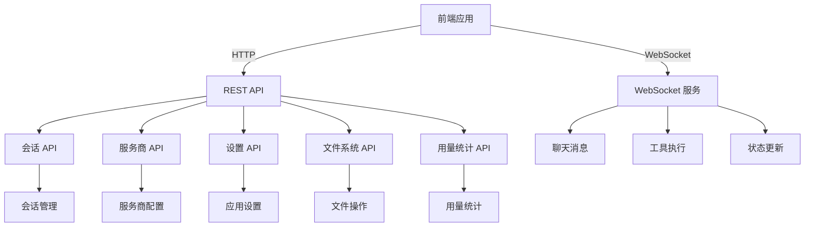
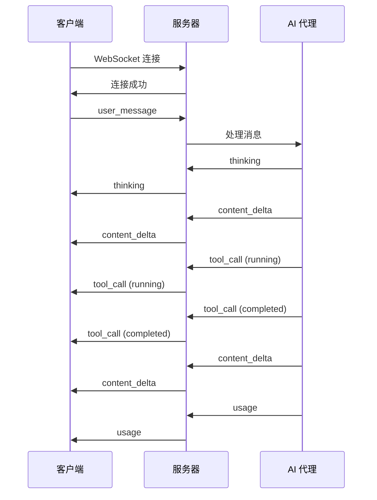
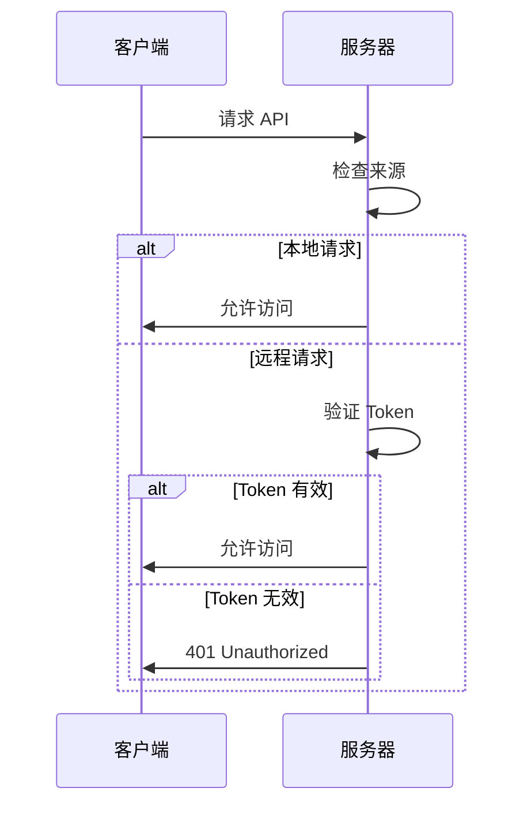

# API 文档概览

本文档描述 Smart Space 项目的 API 接口，包括 REST API 和 WebSocket 通信协议。

## API 架构



## REST API

### 基础信息

| 项目 | 说明 |
|------|------|
| 基础 URL | `http://localhost:{port}` |
| 默认端口 | 3721 |
| 认证方式 | Bearer Token（可选） |
| 内容类型 | `application/json` |
| 字符编码 | UTF-8 |

### 通用响应格式

```typescript
// 成功响应
{
  "status": "ok",
  "data": { ... }
}

// 错误响应
{
  "status": "error",
  "error": "错误信息",
  "code": "ERROR_CODE"
}
```

### API 端点列表

#### 状态 API

```typescript
GET /api/status
```

**响应示例**:
```json
{
  "status": "ok",
  "version": "0.1.0",
  "uptime": 12345,
  "nodeVersion": "v18.0.0",
  "platform": "win32"
}
```

#### 会话 API

```typescript
// 获取会话列表
GET /api/sessions

// 创建会话
POST /api/sessions
// 请求体
{
  "title": "新会话",
  "workMode": "code"
}

// 获取会话详情
GET /api/sessions/:id

// 删除会话
DELETE /api/sessions/:id

// 获取会话消息
GET /api/sessions/:id/messages

// 发送消息
POST /api/sessions/:id/messages
// 请求体
{
  "content": "你好",
  "role": "user"
}
```

**会话对象**:
```typescript
interface Session {
  id: string                    // 会话 ID
  title: string                 // 会话标题
  createdAt: string             // 创建时间
  updatedAt: string             // 更新时间
  workMode: 'code' | 'office'  // 工作模式
  messageCount: number          // 消息数量
  lastMessage: string           // 最后一条消息
}
```

**消息对象**:
```typescript
interface Message {
  id: string                    // 消息 ID
  role: 'user' | 'assistant' | 'system' | 'tool'  // 角色
  content: string               // 消息内容
  timestamp: string             // 时间戳
  toolCalls?: ToolCall[]        // 工具调用
  toolResults?: ToolResult[]    // 工具结果
}
```

#### 服务商 API

```typescript
// 获取服务商列表
GET /api/providers

// 创建服务商
POST /api/providers
// 请求体
{
  "name": "DeepSeek",
  "apiFormat": "openai",
  "apiKey": "sk-xxx",
  "baseUrl": "https://api.deepseek.com",
  "model": "deepseek-chat"
}

// 更新服务商
PUT /api/providers/:id

// 删除服务商
DELETE /api/providers/:id

// 测试服务商连接
POST /api/providers/:id/test
```

**服务商对象**:
```typescript
interface Provider {
  id: string                    // 服务商 ID
  name: string                  // 服务商名称
  apiFormat: 'anthropic' | 'openai'  // API 格式
  apiKey: string                // API 密钥
  baseUrl: string               // API 基础 URL
  model: string                 // 模型名称
  isActive: boolean             // 是否激活
  createdAt: string             // 创建时间
}
```

#### 设置 API

```typescript
// 获取设置
GET /api/settings

// 更新设置
PUT /api/settings
// 请求体
{
  "theme": "dark",
  "locale": "zh-CN",
  "defaultWorkDir": "/home/user/projects"
}
```

**设置对象**:
```typescript
interface Settings {
  theme: 'light' | 'dark' | 'system'  // 主题
  locale: 'zh-CN' | 'en-US'          // 语言
  defaultWorkDir: string              // 默认工作目录
  autoSave: boolean                   // 自动保存
  fontSize: number                    // 字体大小
}
```

#### 文件系统 API

```typescript
// 浏览目录
GET /api/filesystem/browse?path=/home/user

// 读取文件
GET /api/filesystem/read?path=/home/user/file.txt

// 写入文件
POST /api/filesystem/write
// 请求体
{
  "path": "/home/user/file.txt",
  "content": "文件内容"
}

// 删除文件
DELETE /api/filesystem/delete?path=/home/user/file.txt

// 创建目录
POST /api/filesystem/mkdir
// 请求体
{
  "path": "/home/user/new-dir"
}

// 移动文件
POST /api/filesystem/move
// 请求体
{
  "from": "/home/user/old.txt",
  "to": "/home/user/new.txt"
}
```

**文件信息对象**:
```typescript
interface FileInfo {
  name: string                  // 文件名
  path: string                  // 文件路径
  type: 'file' | 'directory'   // 类型
  size: number                  // 大小（字节）
  modifiedAt: string            // 修改时间
  permissions: string           // 权限
}
```

#### Git API

```typescript
// 获取 Git 状态
GET /api/git/status?path=/home/user/project

// 获取 Git 差异
GET /api/git/diff?path=/home/user/project
```

**Git 状态对象**:
```typescript
interface GitStatus {
  branch: string                // 当前分支
  modified: string[]            // 修改的文件
  added: string[]               // 新增的文件
  deleted: string[]             // 删除的文件
  untracked: string[]           // 未跟踪的文件
}
```

#### 用量统计 API

```typescript
// 获取用量统计
GET /api/usage?days=7&provider=deepseek

// 获取每日统计
GET /api/usage/daily?days=7

// 获取模型统计
GET /api/usage/models
```

**用量统计对象**:
```typescript
interface UsageStats {
  daily: DailyStats[]           // 每日统计
  models: ModelStats[]          // 模型统计
  total: TotalStats             // 总计统计
}

interface DailyStats {
  date: string                  // 日期
  inputTokens: number           // 输入 Token
  outputTokens: number          // 输出 Token
  cacheRead: number             // 缓存读取
  cacheCreate: number           // 缓存创建
}

interface ModelStats {
  model: string                 // 模型名称
  provider: string              // 服务商
  totalTokens: number           // 总 Token
  requestCount: number          // 请求次数
}
```

## WebSocket 通信

### 连接信息

| 项目 | 说明 |
|------|------|
| 连接地址 | `ws://localhost:{port}/ws/{sessionId}` |
| 默认端口 | 3721 |
| 协议 | WebSocket |
| 消息格式 | JSON |

### 消息类型

#### 用户消息

```typescript
// 发送用户消息
{
  "type": "user_message",
  "sessionId": "session-1",
  "timestamp": 1704067200000,
  "data": {
    "content": "你好",
    "role": "user"
  }
}
```

#### AI 流式响应

```typescript
// 内容增量
{
  "type": "content_delta",
  "sessionId": "session-1",
  "timestamp": 1704067201000,
  "data": {
    "content": "你好！",
    "thinking": "用户打招呼..."
  }
}

// 思考过程
{
  "type": "thinking",
  "sessionId": "session-1",
  "timestamp": 1704067201000,
  "data": {
    "content": "用户打招呼，我应该友好回应..."
  }
}
```

#### 工具调用

```typescript
// 工具调用开始
{
  "type": "tool_call",
  "sessionId": "session-1",
  "timestamp": 1704067202000,
  "data": {
    "id": "tool-call-1",
    "name": "read_file",
    "input": {
      "path": "/home/user/file.txt"
    },
    "status": "running"
  }
}

// 工具调用完成
{
  "type": "tool_call",
  "sessionId": "session-1",
  "timestamp": 1704067203000,
  "data": {
    "id": "tool-call-1",
    "name": "read_file",
    "input": {
      "path": "/home/user/file.txt"
    },
    "status": "completed",
    "output": "文件内容..."
  }
}
```

#### 用量统计

```typescript
// 用量更新
{
  "type": "usage",
  "sessionId": "session-1",
  "timestamp": 1704067204000,
  "data": {
    "inputTokens": 100,
    "outputTokens": 50,
    "cacheRead": 10,
    "cacheCreate": 5
  }
}
```

#### 状态更新

```typescript
// 连接状态
{
  "type": "status",
  "sessionId": "session-1",
  "timestamp": 1704067205000,
  "data": {
    "status": "connected",
    "message": "连接成功"
  }
}

// 错误信息
{
  "type": "error",
  "sessionId": "session-1",
  "timestamp": 1704067206000,
  "data": {
    "code": "TOOL_ERROR",
    "message": "工具执行失败"
  }
}
```

### 消息流示例



## 认证机制

### Bearer Token 认证

```typescript
// 请求头
Authorization: Bearer <token>

// 示例
fetch('/api/sessions', {
  headers: {
    'Authorization': 'Bearer your-token-here'
  }
})
```

### 认证流程



## 错误处理

### HTTP 状态码

| 状态码 | 说明 |
|--------|------|
| 200 | 成功 |
| 201 | 创建成功 |
| 400 | 请求错误 |
| 401 | 未授权 |
| 403 | 禁止访问 |
| 404 | 资源不存在 |
| 500 | 服务器错误 |

### 错误响应格式

```typescript
interface ErrorResponse {
  status: 'error'
  error: string              // 错误信息
  code: string               // 错误代码
  details?: any              // 详细信息
}
```

### 常见错误代码

| 错误代码 | 说明 |
|----------|------|
| `VALIDATION_ERROR` | 输入验证失败 |
| `NOT_FOUND` | 资源不存在 |
| `UNAUTHORIZED` | 未授权 |
| `FORBIDDEN` | 禁止访问 |
| `INTERNAL_ERROR` | 内部错误 |
| `TOOL_ERROR` | 工具执行错误 |
| `LLM_ERROR` | LLM 调用错误 |

## 速率限制

### 限制策略

| API | 限制 | 说明 |
|-----|------|------|
| REST API | 100 请求/分钟 | 常规 API |
| WebSocket | 10 消息/秒 | 实时消息 |
| 文件操作 | 50 请求/分钟 | 文件系统操作 |

### 限制响应

```typescript
// 超出限制响应
{
  "status": "error",
  "error": "Rate limit exceeded",
  "code": "RATE_LIMIT_EXCEEDED",
  "retryAfter": 60
}
```

## SDK 和客户端

### JavaScript/TypeScript 客户端

```typescript
import { SmartSpaceClient } from 'smart-space-sdk'

const client = new SmartSpaceClient({
  baseUrl: 'http://localhost:3721',
  token: 'your-token'
})

// 获取会话列表
const sessions = await client.sessions.list()

// 创建会话
const session = await client.sessions.create({
  title: '新会话',
  workMode: 'code'
})

// 发送消息
await client.messages.send(session.id, {
  content: '你好',
  role: 'user'
})
```

### WebSocket 客户端

```typescript
import { SmartSpaceWebSocket } from 'smart-space-sdk'

const ws = new SmartSpaceWebSocket({
  url: 'ws://localhost:3721/ws/session-1'
})

ws.on('content_delta', (data) => {
  console.log('内容更新:', data.content)
})

ws.on('tool_call', (data) => {
  console.log('工具调用:', data.name)
})

ws.connect()
```

## 测试 API

### 使用 curl 测试

```bash
# 获取会话列表
curl http://localhost:3721/api/sessions

# 创建会话
curl -X POST http://localhost:3721/api/sessions \
  -H "Content-Type: application/json" \
  -d '{"title":"测试会话","workMode":"code"}'

# 获取服务商列表
curl http://localhost:3721/api/providers
```

### 使用 wscat 测试 WebSocket

```bash
# 安装 wscat
npm install -g wscat

# 连接 WebSocket
wscat -c ws://localhost:3721/ws/session-1

# 发送消息
> {"type":"user_message","content":"Hello"}
```

## 相关文档

- [架构概述](../architecture/overview.md) - 整体架构设计
- [服务端架构](../architecture/server.md) - 服务端详细设计
- [开发指南](../development/setup.md) - 开发环境搭建
- [技术栈](../tech-stack/overview.md) - 技术栈列表

---

**下一步**: 了解 [服务端架构](../architecture/server.md) 的详细设计，或查看 [开发指南](../development/setup.md) 搭建开发环境。