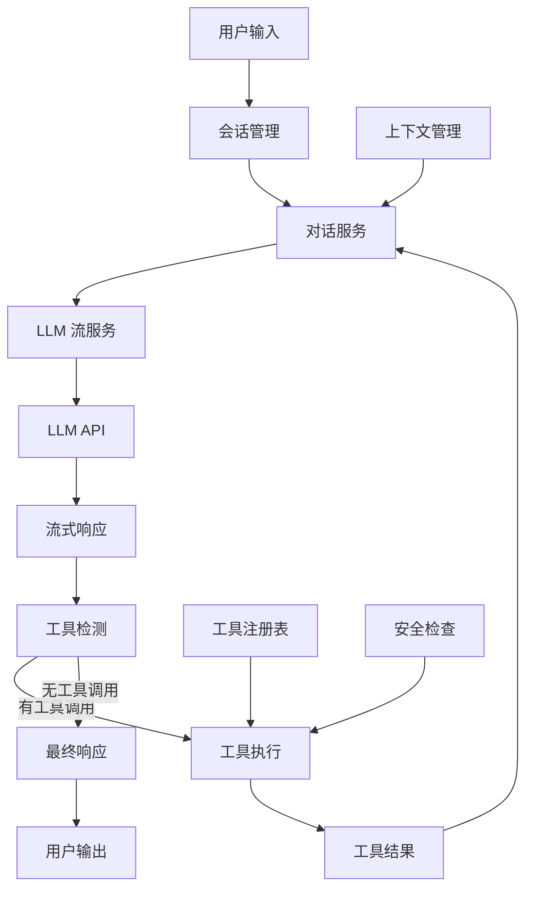
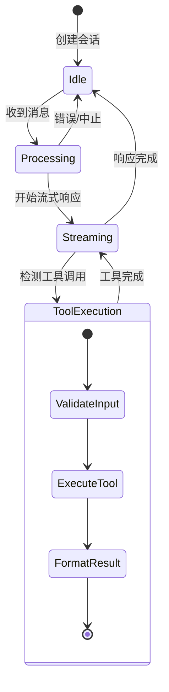
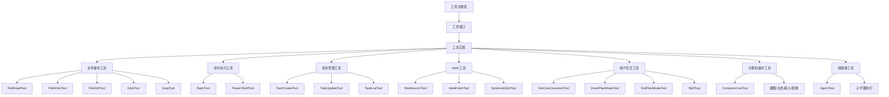
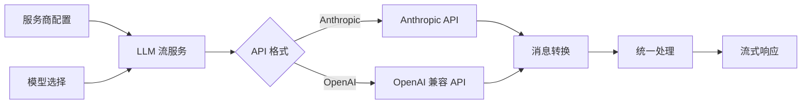
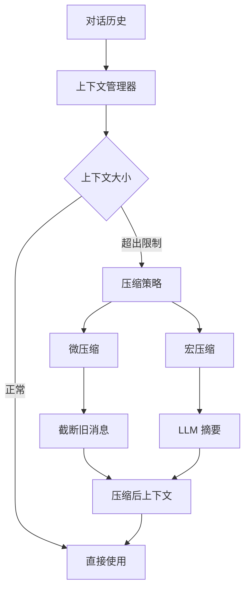
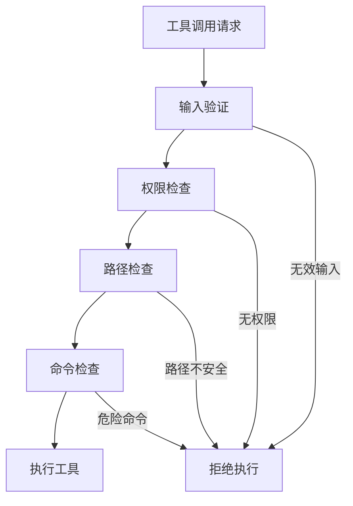
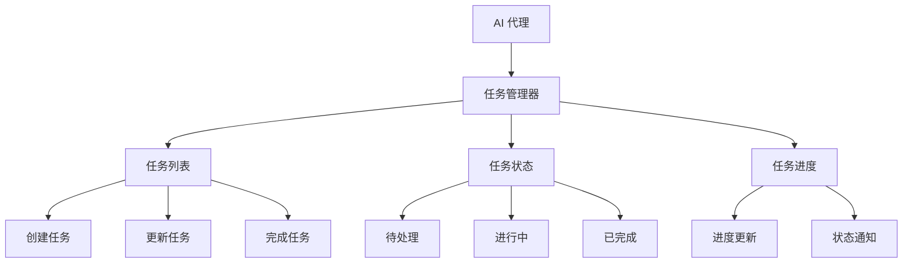
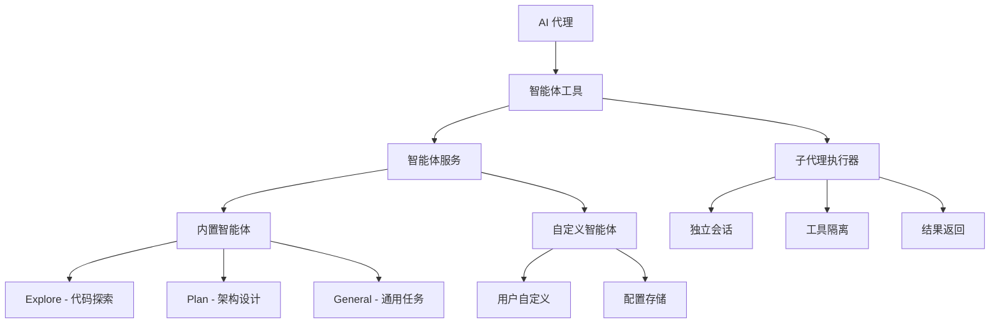

# AI 代理架构

本文档详细描述 Smart Lab AI 代理系统的架构设计，包括 LLM 集成、工具执行、会话管理和安全机制。

## 架构概览



## 核心组件

### 1. 会话管理 (Session Management)

管理用户会话的生命周期和状态：



### 2. 对话服务 (ConversationService)

协调整个对话流程：

```typescript
class ConversationService {
  // 处理用户消息
  async handleMessage(sessionId: string, message: Message): Promise<void> {
    // 1. 获取会话历史
    const history = await this.sessionService.getMessages(sessionId)
    
    // 2. 添加用户消息
    history.push(message)
    
    // 3. 管理上下文窗口
    const context = await this.compactService.manageContext(history)
    
    // 4. 调用 LLM
    const stream = await this.llmStreamService.streamCompletion(
      provider,
      context,
      tools
    )
    
    // 5. 处理流式响应
    for await (const chunk of stream) {
      if (chunk.type === 'tool_call') {
        await this.executeTool(sessionId, chunk.toolCall)
      } else {
        await this.sendContentDelta(sessionId, chunk)
      }
    }
  }
  
  // 执行工具
  async executeTool(sessionId: string, toolCall: ToolCall): Promise<ToolResult> {
    // 1. 验证工具
    const tool = this.toolRegistry.getTool(toolCall.name)
    if (!tool) {
      throw new Error(`Tool not found: ${toolCall.name}`)
    }
    
    // 2. 安全检查
    await this.securityCheck(toolCall)
    
    // 3. 执行工具
    const result = await tool.execute(toolCall.input, {
      sessionId,
      abortController: this.getAbortController(sessionId)
    })
    
    // 4. 发送结果
    await this.sendToolResult(sessionId, toolCall.id, result)
    
    return result
  }
}
```

### 3. LLM 流服务 (LLMStreamService)

处理 LLM API 调用和流式响应：

```typescript
class LLMStreamService {
  // 流式调用 LLM
  async *streamCompletion(
    provider: Provider,
    messages: Message[],
    tools: Tool[]
  ): AsyncGenerator<StreamChunk> {
    // 1. 构建请求
    const request = this.buildRequest(provider, messages, tools)
    
    // 2. 调用 API
    const response = await this.callAPI(provider, request)
    
    // 3. 处理流式响应
    for await (const chunk of response) {
      yield this.processChunk(chunk)
    }
  }
  
  // 构建请求
  private buildRequest(provider: Provider, messages: Message[], tools: Tool[]): Request {
    if (provider.apiFormat === 'anthropic') {
      return this.buildAnthropicRequest(messages, tools)
    } else {
      return this.buildOpenAIRequest(messages, tools)
    }
  }
  
  // 调用 API
  private async callAPI(provider: Provider, request: Request): Promise<Response> {
    const response = await fetch(provider.baseUrl + '/v1/chat/completions', {
      method: 'POST',
      headers: {
        'Content-Type': 'application/json',
        'Authorization': `Bearer ${provider.apiKey}`
      },
      body: JSON.stringify(request)
    })
    
    return response.body
  }
}
```

## 工具系统

### 工具架构



### 工具接口

```typescript
interface Tool {
  // 工具名称
  name: string
  
  // 工具描述
  description: string
  
  // 输入模式（JSON Schema）
  inputSchema: JSONSchema
  
  // 执行工具
  execute(input: any, context: ToolContext): Promise<ToolResult>
  
  // 验证输入
  validateInput(input: any): ValidationResult
}

interface ToolContext {
  // 会话 ID
  sessionId: string
  
  // 中止控制器
  abortController: AbortController
  
  // 工作目录
  workingDirectory: string
  
  // 环境变量
  env: Record<string, string>
}

interface ToolResult {
  // 输出内容
  output: string
  
  // 错误信息
  error?: string
  
  // 退出代码
  exitCode?: number
  
  // 附加数据
  metadata?: Record<string, any>
}
```

### 核心工具实现

#### Bash 工具

```typescript
class BashTool implements Tool {
  name = 'bash'
  description = '执行 Bash 命令'
  inputSchema = {
    type: 'object',
    properties: {
      command: {
        type: 'string',
        description: '要执行的命令'
      },
      workingDirectory: {
        type: 'string',
        description: '工作目录'
      }
    },
    required: ['command']
  }
  
  async execute(input: { command: string; workingDirectory?: string }, context: ToolContext): Promise<ToolResult> {
    const { command, workingDirectory } = input
    const cwd = workingDirectory || context.workingDirectory
    
    // 安全检查
    this.validateCommand(command)
    
    // 执行命令
    const result = await execAsync(command, {
      cwd,
      timeout: 30000,
      env: { ...process.env, ...context.env }
    })
    
    return {
      output: result.stdout,
      error: result.stderr,
      exitCode: result.exitCode
    }
  }
  
  private validateCommand(command: string): void {
    // 检查危险命令
    const dangerousCommands = ['rm -rf', 'mkfs', 'dd', 'format']
    for (const dangerous of dangerousCommands) {
      if (command.includes(dangerous)) {
        throw new Error(`Dangerous command detected: ${dangerous}`)
      }
    }
  }
}
```

#### 文件读取工具

```typescript
class FileReadTool implements Tool {
  name = 'read_file'
  description = '读取文件内容'
  inputSchema = {
    type: 'object',
    properties: {
      path: {
        type: 'string',
        description: '文件路径'
      },
      offset: {
        type: 'number',
        description: '起始行号'
      },
      limit: {
        type: 'number',
        description: '读取行数'
      }
    },
    required: ['path']
  }
  
  async execute(input: { path: string; offset?: number; limit?: number }): Promise<ToolResult> {
    const { path, offset = 0, limit = 100 } = input
    
    // 路径安全检查
    this.validatePath(path)
    
    // 读取文件
    const content = await fs.readFile(path, 'utf-8')
    const lines = content.split('\n')
    const selectedLines = lines.slice(offset, offset + limit)
    
    return {
      output: selectedLines.join('\n'),
      metadata: {
        totalLines: lines.length,
        startLine: offset,
        endLine: Math.min(offset + limit, lines.length)
      }
    }
  }
  
  private validatePath(path: string): void {
    const homeDir = os.homedir()
    const tmpDir = os.tmpdir()
    
    if (!path.startsWith(homeDir) && !path.startsWith(tmpDir)) {
      throw new Error('Access denied: Path outside allowed directories')
    }
  }
}
```

#### 任务管理工具

```typescript
class TaskTool implements Tool {
  name = 'task'
  description = '管理任务列表'
  inputSchema = {
    type: 'object',
    properties: {
      action: {
        type: 'string',
        enum: ['create', 'update', 'query', 'complete'],
        description: '任务操作'
      },
      title: {
        type: 'string',
        description: '任务标题'
      },
      description: {
        type: 'string',
        description: '任务描述'
      },
      taskId: {
        type: 'string',
        description: '任务 ID'
      },
      status: {
        type: 'string',
        enum: ['pending', 'in_progress', 'completed'],
        description: '任务状态'
      }
    },
    required: ['action']
  }
  
  async execute(input: any, context: ToolContext): Promise<ToolResult> {
    const taskService = this.getTaskService(context.sessionId)
    
    switch (input.action) {
      case 'create':
        return this.createTask(taskService, input)
      case 'update':
        return this.updateTask(taskService, input)
      case 'query':
        return this.queryTasks(taskService, input)
      case 'complete':
        return this.completeTask(taskService, input)
      default:
        throw new Error(`Unknown action: ${input.action}`)
    }
  }
}
```

## LLM 集成

### 多服务商支持



### API 格式转换

```typescript
// Anthropic 格式
interface AnthropicRequest {
  model: string
  max_tokens: number
  messages: AnthropicMessage[]
  tools?: AnthropicTool[]
  stream: boolean
}

// OpenAI 格式
interface OpenAIRequest {
  model: string
  messages: OpenAIMessage[]
  tools?: OpenAITool[]
  stream: boolean
}

// 统一转换
function buildRequest(provider: Provider, messages: Message[], tools: Tool[]): Request {
  if (provider.apiFormat === 'anthropic') {
    return {
      model: provider.model,
      max_tokens: 4096,
      messages: messages.map(convertToAnthropicMessage),
      tools: tools.map(convertToAnthropicTool),
      stream: true
    }
  } else {
    return {
      model: provider.model,
      messages: messages.map(convertToOpenAIMessage),
      tools: tools.map(convertToOpenAITool),
      stream: true
    }
  }
}
```

### 流式响应处理

```typescript
async function* processStream(response: Response): AsyncGenerator<StreamChunk> {
  const reader = response.body.getReader()
  const decoder = new TextDecoder()
  let buffer = ''
  
  while (true) {
    const { done, value } = await reader.read()
    if (done) break
    
    buffer += decoder.decode(value, { stream: true })
    const lines = buffer.split('\n')
    buffer = lines.pop() || ''
    
    for (const line of lines) {
      if (line.startsWith('data: ')) {
        const data = line.slice(6)
        if (data === '[DONE]') break
        
        const chunk = JSON.parse(data)
        yield processChunk(chunk)
      }
    }
  }
}
```

## 上下文管理

### 上下文窗口管理



### 压缩策略

```typescript
class CompactService {
  // 管理上下文
  async manageContext(messages: Message[]): Promise<Message[]> {
    const tokenCount = this.countTokens(messages)
    const maxTokens = this.getMaxTokens()
    
    if (tokenCount <= maxTokens) {
      return messages
    }
    
    // 尝试微压缩
    const compacted = await this.microCompact(messages, maxTokens)
    if (this.countTokens(compacted) <= maxTokens) {
      return compacted
    }
    
    // 尝试宏压缩
    return await this.macroCompact(messages, maxTokens)
  }
  
  // 微压缩：截断旧消息
  async microCompact(messages: Message[], maxTokens: number): Promise<Message[]> {
    const systemMessages = messages.filter(m => m.role === 'system')
    const otherMessages = messages.filter(m => m.role !== 'system')
    
    // 保留最近的消息
    let result = [...systemMessages]
    let currentTokens = this.countTokens(result)
    
    for (let i = otherMessages.length - 1; i >= 0; i--) {
      const message = otherMessages[i]
      const messageTokens = this.countTokens([message])
      
      if (currentTokens + messageTokens > maxTokens) {
        break
      }
      
      result.unshift(message)
      currentTokens += messageTokens
    }
    
    return result
  }
  
  // 宏压缩：LLM 摘要
  async macroCompact(messages: Message[], maxTokens: number): Promise<Message[]> {
    const systemMessages = messages.filter(m => m.role === 'system')
    const otherMessages = messages.filter(m => m.role !== 'system')
    
    // 使用 LLM 生成摘要
    const summary = await this.generateSummary(otherMessages)
    
    return [
      ...systemMessages,
      {
        role: 'system',
        content: `以下是之前对话的摘要：\n\n${summary}`
      },
      // 保留最近几条消息
      ...otherMessages.slice(-3)
    ]
  }
}
```

## 安全机制

### 安全检查流程



### 工具执行安全

```typescript
class SecurityManager {
  // 验证工具调用
  async validateToolCall(toolCall: ToolCall): Promise<void> {
    // 1. 验证工具存在
    const tool = this.toolRegistry.getTool(toolCall.name)
    if (!tool) {
      throw new Error(`Tool not found: ${toolCall.name}`)
    }
    
    // 2. 验证输入
    const validation = tool.validateInput(toolCall.input)
    if (!validation.valid) {
      throw new Error(`Invalid input: ${validation.error}`)
    }
    
    // 3. 权限检查
    await this.checkPermissions(toolCall)
    
    // 4. 特定工具安全检查
    if (toolCall.name === 'bash') {
      await this.validateBashCommand(toolCall.input.command)
    }
    
    if (toolCall.name === 'read_file' || toolCall.name === 'write_file') {
      await this.validateFilePath(toolCall.input.path)
    }
  }
  
  // 验证 Bash 命令
  private async validateBashCommand(command: string): Promise<void> {
    const dangerousPatterns = [
      /rm\s+-rf\s+\/,           // 删除根目录
      /mkfs/,                    // 格式化文件系统
      /dd\s+.*of=\/dev\/[sh]d/, // 写入磁盘
      /format\s+[a-z]:/i,       // Windows 格式化
      /del\s+\/[sfq]\s+[a-z]:/i // Windows 删除
    ]
    
    for (const pattern of dangerousPatterns) {
      if (pattern.test(command)) {
        throw new Error(`Dangerous command detected: ${command}`)
      }
    }
  }
  
  // 验证文件路径
  private async validateFilePath(path: string): Promise<void> {
    const homeDir = os.homedir()
    const tmpDir = os.tmpdir()
    
    // 解析路径
    const resolvedPath = path.resolve(path)
    
    // 检查路径是否在允许的目录内
    if (!resolvedPath.startsWith(homeDir) && !resolvedPath.startsWith(tmpDir)) {
      throw new Error('Access denied: Path outside allowed directories')
    }
    
    // 检查敏感文件
    const sensitiveFiles = [
      '.ssh/id_rsa',
      '.ssh/id_ed25519',
      '.aws/credentials',
      '.env'
    ]
    
    for (const sensitive of sensitiveFiles) {
      if (resolvedPath.endsWith(sensitive)) {
        throw new Error('Access denied: Sensitive file')
      }
    }
  }
}
```

## 循环检测和恢复

### 循环检测

```typescript
class LoopDetector {
  private recentCalls: Map<string, string[]> = new Map()
  
  // 检测循环
  detectLoop(sessionId: string, toolCall: ToolCall): boolean {
    const key = `${sessionId}:${toolCall.name}`
    const calls = this.recentCalls.get(key) || []
    
    // 检查是否有重复调用
    const callHash = this.hashCall(toolCall)
    if (calls.includes(callHash)) {
      return true
    }
    
    // 更新调用历史
    calls.push(callHash)
    if (calls.length > 3) {
      calls.shift()
    }
    this.recentCalls.set(key, calls)
    
    return false
  }
  
  // 哈希工具调用
  private hashCall(toolCall: ToolCall): string {
    return `${toolCall.name}:${JSON.stringify(toolCall.input)}`
  }
}
```

### 错误恢复

```typescript
class ErrorRecovery {
  // 处理工具执行错误
  async handleToolError(
    sessionId: string,
    toolCall: ToolCall,
    error: Error
  ): Promise<void> {
    // 1. 记录错误
    await this.logError(sessionId, toolCall, error)
    
    // 2. 发送错误信息给用户
    await this.sendErrorMessage(sessionId, error.message)
    
    // 3. 提供修复建议
    const suggestion = this.getSuggestion(toolCall, error)
    if (suggestion) {
      await this.sendSuggestion(sessionId, suggestion)
    }
    
    // 4. 如果是可恢复错误，重试
    if (this.isRetryable(error)) {
      await this.retryToolCall(sessionId, toolCall)
    }
  }
  
  // 获取修复建议
  private getSuggestion(toolCall: ToolCall, error: Error): string | null {
    if (toolCall.name === 'bash' && error.message.includes('command not found')) {
      return '请检查命令是否正确安装，或尝试使用完整路径。'
    }
    
    if (toolCall.name === 'read_file' && error.message.includes('ENOENT')) {
      return '文件不存在，请检查路径是否正确。'
    }
    
    return null
  }
}
```

## 任务管理

### 任务系统



### 任务实现

```typescript
class TaskService {
  private tasks: Map<string, Task[]> = new Map()
  
  // 创建任务
  async createTask(sessionId: string, task: TaskCreate): Promise<Task> {
    const newTask: Task = {
      id: uuid(),
      sessionId,
      title: task.title,
      description: task.description,
      status: 'pending',
      createdAt: new Date(),
      updatedAt: new Date()
    }
    
    const sessionTasks = this.tasks.get(sessionId) || []
    sessionTasks.push(newTask)
    this.tasks.set(sessionId, sessionTasks)
    
    // 通知前端
    await this.notifyFrontend(sessionId, 'task_created', newTask)
    
    return newTask
  }
  
  // 更新任务状态
  async updateTaskStatus(
    sessionId: string,
    taskId: string,
    status: TaskStatus
  ): Promise<Task> {
    const sessionTasks = this.tasks.get(sessionId) || []
    const task = sessionTasks.find(t => t.id === taskId)
    
    if (!task) {
      throw new Error(`Task not found: ${taskId}`)
    }
    
    task.status = status
    task.updatedAt = new Date()
    
    // 通知前端
    await this.notifyFrontend(sessionId, 'task_updated', task)
    
    return task
  }
  
  // 查询任务
  async getTasks(sessionId: string): Promise<Task[]> {
    return this.tasks.get(sessionId) || []
  }
}
```

## 智能体管理

### 智能体系统

智能体系统支持内置智能体和自定义智能体，允许 LLM 调用子代理执行复杂任务。



### 内置智能体

| 智能体 | 用途 | 工具限制 |
|--------|------|----------|
| **Explore** | 代码库探索，查找文件和搜索代码 | 只读工具 |
| **Plan** | 软件架构设计，制定实现计划 | 只读工具 |
| **General** | 通用任务，研究复杂问题和执行多步骤任务 | 所有工具 |

### 智能体服务

```typescript
class AgentService {
  // 获取智能体定义
  async getAgent(agentType: string): Promise<AgentDefinition | null>
  
  // 列出所有智能体
  async listAllAgents(): Promise<AgentDefinition[]>
  
  // 创建自定义智能体
  async createCustomAgent(input: CustomAgentInput): Promise<AgentDefinition>
  
  // 更新自定义智能体
  async updateCustomAgent(agentType: string, updates: Partial<CustomAgentInput>): Promise<AgentDefinition>
  
  // 删除自定义智能体
  async deleteCustomAgent(agentType: string): Promise<void>
}
```

### 子代理执行

```typescript
class SubAgentRunner {
  // 执行子代理
  async runSubAgent(
    agent: AgentDefinition,
    prompt: string,
    context: ToolContext
  ): Promise<string> {
    // 1. 创建独立会话
    const session = await this.createSession(agent.agentType)
    
    // 2. 设置系统提示
    await this.setSystemPrompt(session.id, agent.systemPrompt)
    
    // 3. 过滤工具
    const tools = this.filterTools(agent.tools, agent.disallowedTools)
    
    // 4. 执行对话
    const result = await this.executeConversation(session.id, prompt, tools)
    
    // 5. 返回结果
    return result
  }
}
```

## 性能优化

### 并发控制

```typescript
class ConcurrencyManager {
  private semaphore: Semaphore
  
  constructor(maxConcurrent: number) {
    this.semaphore = new Semaphore(maxConcurrent)
  }
  
  // 执行并发任务
  async execute<T>(task: () => Promise<T>): Promise<T> {
    await this.semaphore.acquire()
    try {
      return await task()
    } finally {
      this.semaphore.release()
    }
  }
}
```

### 缓存策略

```typescript
class ToolResultCache {
  private cache: Map<string, { result: ToolResult; timestamp: number }> = new Map()
  private ttl: number = 5 * 60 * 1000 // 5 分钟
  
  // 获取缓存结果
  get(toolCall: ToolCall): ToolResult | null {
    const key = this.getCacheKey(toolCall)
    const cached = this.cache.get(key)
    
    if (cached && Date.now() - cached.timestamp < this.ttl) {
      return cached.result
    }
    
    return null
  }
  
  // 设置缓存
  set(toolCall: ToolCall, result: ToolResult): void {
    const key = this.getCacheKey(toolCall)
    this.cache.set(key, { result, timestamp: Date.now() })
  }
  
  private getCacheKey(toolCall: ToolCall): string {
    return `${toolCall.name}:${JSON.stringify(toolCall.input)}`
  }
}
```

## 监控和日志

### 代理监控

```typescript
class AgentMonitor {
  // 监控指标
  private metrics = {
    totalRequests: 0,
    successfulRequests: 0,
    failedRequests: 0,
    toolCalls: 0,
    averageResponseTime: 0,
    tokenUsage: {
      input: 0,
      output: 0,
      cacheRead: 0,
      cacheCreate: 0
    }
  }
  
  // 记录请求
  recordRequest(success: boolean, duration: number): void {
    this.metrics.totalRequests++
    if (success) {
      this.metrics.successfulRequests++
    } else {
      this.metrics.failedRequests++
    }
    
    // 更新平均响应时间
    this.metrics.averageResponseTime = 
      (this.metrics.averageResponseTime * (this.metrics.totalRequests - 1) + duration) / 
      this.metrics.totalRequests
  }
  
  // 记录工具调用
  recordToolCall(toolName: string, success: boolean): void {
    this.metrics.toolCalls++
  }
  
  // 记录 Token 使用
  recordTokenUsage(usage: TokenUsage): void {
    this.metrics.tokenUsage.input += usage.input
    this.metrics.tokenUsage.output += usage.output
    this.metrics.tokenUsage.cacheRead += usage.cacheRead
    this.metrics.tokenUsage.cacheCreate += usage.cacheCreate
  }
}
```

## 相关文档

- [架构概述](overview.md) - 整体架构设计
- [服务端架构](server.md) - 服务端详细设计
- [技术栈](../tech-stack/overview.md) - 完整技术栈列表
- [工具系统](../integrations/tools.md) - 工具系统详细说明

---

**下一步**: 了解 [技术栈](../tech-stack/overview.md) 的完整列表，或查看 [工具系统](../integrations/tools.md) 了解工具的详细说明。