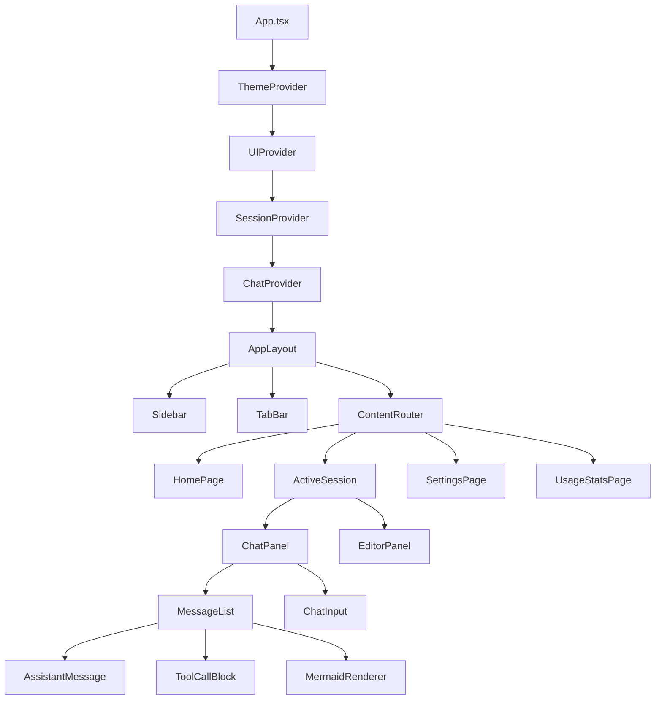
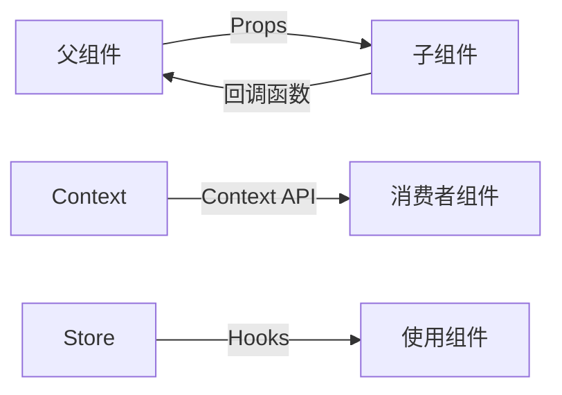
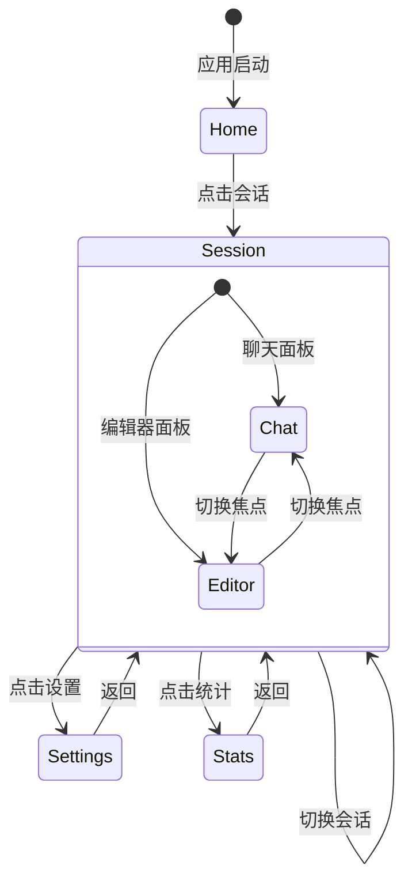

# 前端架构

本文档详细描述 Smart Space 前端 React 应用的架构设计，包括组件组织、状态管理、路由系统和构建配置。

## 技术栈

| 技术 | 版本 | 用途 |
|------|------|------|
| React | 18.3+ | 用户界面库 |
| TypeScript | 5.5+ | 类型安全开发 |
| Vite | 5.4+ | 构建工具和开发服务器 |
| Tailwind CSS | 4.3+ | 实用优先的 CSS 框架 |
| Monaco Editor | 0.55+ | 代码编辑器 |
| ECharts | 6.1+ | 图表库 |
| Mermaid | 10.9+ | 图表渲染 |
| react-markdown | 10.1+ | Markdown 渲染 |
| Zustand | 5.0+ | 状态管理（备用） |

## 目录结构

```
desktop/src/
├── api/                    # API 客户端模块
│   ├── client.ts          # 基础 HTTP 客户端
│   ├── sessions.ts        # 会话 API
│   ├── providers.ts       # 服务商 API
│   ├── settings.ts        # 设置 API
│   ├── tasks.ts           # 任务 API
│   ├── filesystem.ts      # 文件系统 API
│   ├── git.ts             # Git API
│   └── usage.ts           # 用量统计 API
├── components/            # UI 组件
│   ├── chat/             # 聊天相关组件
│   │   ├── MessageList.tsx
│   │   ├── ChatInput.tsx
│   │   ├── AssistantMessage.tsx
│   │   ├── ToolCallBlock.tsx
│   │   └── MermaidRenderer.tsx
│   ├── editor/           # 编辑器组件
│   │   ├── CodeEditor.tsx
│   │   ├── FileExplorer.tsx
│   │   └── EditorPanel.tsx
│   ├── layout/           # 布局组件
│   │   ├── Sidebar.tsx
│   │   ├── TabBar.tsx
│   │   ├── ContentRouter.tsx
│   │   └── WindowControls.tsx
│   ├── settings/         # 设置组件
│   │   ├── ProviderSettings.tsx
│   │   ├── SkillsSettings.tsx
│   │   └── GeneralSettings.tsx
│   ├── markdown/         # Markdown 渲染
│   └── shared/           # 共享组件
│       ├── Modal.tsx
│       ├── Tooltip.tsx
│       └── CopyButton.tsx
├── pages/                # 页面组件
│   ├── HomePage.tsx      # 首页
│   ├── ActiveSession.tsx # 活跃会话
│   ├── EmptySession.tsx  # 空会话
│   ├── SettingsPage.tsx  # 设置页
│   └── UsageStatsPage.tsx # 用量统计
├── stores/               # 状态管理
│   ├── uiStore.tsx       # UI 状态
│   ├── sessionStore.tsx  # 会话状态
│   ├── chatStore.tsx     # 聊天状态
│   ├── cliTaskStore.tsx  # CLI 任务状态
│   ├── editorStore.ts    # 编辑器状态
│   └── pendingRefStore.ts # 引用状态
├── i18n/                 # 国际化
│   ├── index.ts          # i18n 配置
│   ├── zh-CN.ts          # 中文翻译
│   └── en-US.ts          # 英文翻译
├── theme/                # 主题配置
│   ├── index.ts          # 主题配置
│   └── colors.ts         # 颜色定义
├── types/                # 类型定义
│   ├── index.ts          # 类型导出
│   └── api.ts            # API 类型
├── App.tsx               # 应用根组件
├── main.tsx              # 应用入口
└── vite-env.d.ts         # Vite 环境类型
```

## 组件架构

### 组件层次结构



### 组件设计原则

1. **单一职责**: 每个组件只负责一个功能
2. **可组合性**: 组件可以自由组合
3. **可复用性**: 共享组件放在 `shared/` 目录
4. **类型安全**: 所有组件都有完整的 TypeScript 类型

### 组件通信模式



## 状态管理

### Context + Hooks 模式

使用 React Context + Hooks 而非 Redux：

```typescript
// 状态定义
interface UIState {
  theme: 'light' | 'dark'
  locale: 'zh-CN' | 'en-US'
  sidebarCollapsed: boolean
  defaultWorkDir: string
}

// Context 创建
const UIContext = createContext<{
  state: UIState
  setState: React.Dispatch<React.SetStateAction<UIState>>
} | null>(null)

// Provider 组件
export function UIProvider({ children }: { children: React.ReactNode }) {
  const [state, setState] = useState<UIState>(initialState)
  
  return (
    <UIContext.Provider value={{ state, setState }}>
      {children}
    </UIContext.Provider>
  )
}

// 自定义 Hook
export function useUI() {
  const context = useContext(UIContext)
  if (!context) {
    throw new Error('useUI must be used within UIProvider')
  }
  return context
}
```

### 主要状态存储

#### uiStore - UI 状态管理

```typescript
interface UIState {
  theme: 'light' | 'dark'           // 主题模式
  locale: 'zh-CN' | 'en-US'        // 语言设置
  sidebarCollapsed: boolean         // 侧边栏折叠状态
  defaultWorkDir: string           // 默认工作目录
  activeTab: string                // 当前活动标签
  tabs: Tab[]                      // 标签列表
}
```

#### sessionStore - 会话状态管理

```typescript
interface SessionState {
  sessions: Session[]              // 会话列表
  activeSessionId: string | null   // 当前活动会话
  loading: boolean                 // 加载状态
  error: string | null             // 错误信息
}
```

#### chatStore - 聊天状态管理

```typescript
interface ChatState {
  messages: Message[]              // 消息列表
  isStreaming: boolean             // 流式传输状态
  currentToolCall: ToolCall | null // 当前工具调用
  pendingMessages: Message[]       // 待发送消息
}
```

## 路由系统

### 自定义标签页导航

不使用 React Router，而是实现自定义标签页系统：



### 标签页类型

```typescript
interface Tab {
  id: string                      // 标签页 ID
  type: 'home' | 'session' | 'settings' | 'stats'  // 标签页类型
  title: string                   // 标签页标题
  sessionId?: string              // 会话 ID（仅会话标签页）
}
```

### ContentRouter 组件

```typescript
function ContentRouter() {
  const { activeTab } = useUI()
  
  switch (activeTab.type) {
    case 'home':
      return <HomePage />
    case 'session':
      return <ActiveSession sessionId={activeTab.sessionId} />
    case 'settings':
      return <SettingsPage />
    case 'stats':
      return <UsageStatsPage />
    default:
      return <HomePage />
  }
}
```

## API 通信

### HTTP 客户端

```typescript
// 基础客户端配置
const api = axios.create({
  baseURL: `http://localhost:${port}`,
  timeout: 30000,
  headers: {
    'Content-Type': 'application/json',
  },
})

// 动态端口发现
async function getServerPort(): Promise<number> {
  try {
    const portFile = await readFile('~/.spaceai/server.port')
    return parseInt(portFile, 10)
  } catch {
    return 3721 // 默认端口
  }
}
```

### WebSocket 管理

```typescript
class WebSocketManager {
  private connections: Map<string, WebSocket> = new Map()
  
  connect(sessionId: string): WebSocket {
    const ws = new WebSocket(`ws://localhost:${port}/ws/${sessionId}`)
    
    ws.onmessage = (event) => {
      const data = JSON.parse(event.data)
      this.handleMessage(sessionId, data)
    }
    
    this.connections.set(sessionId, ws)
    return ws
  }
  
  private handleMessage(sessionId: string, data: any) {
    switch (data.type) {
      case 'content_delta':
        // 更新消息内容
        break
      case 'tool_call':
        // 显示工具调用
        break
      case 'usage':
        // 更新用量统计
        break
    }
  }
}
```

## 构建配置

### Vite 配置

```typescript
// vite.config.ts
export default defineConfig({
  plugins: [react(), tailwindcss()],
  build: {
    outDir: 'dist',
    sourcemap: true,
    minify: 'terser',
    rollupOptions: {
      output: {
        manualChunks: {
          vendor: ['react', 'react-dom'],
          editor: ['monaco-editor'],
          charts: ['echarts'],
        },
      },
    },
  },
  server: {
    port: 1420,
    strictPort: true,
  },
})
```

### 开发服务器

```bash
# 启动开发服务器
npm run dev

# 开发服务器配置
VITE_DEV_SERVER_URL=http://localhost:1420
```

### 生产构建

```bash
# 构建生产版本
npm run build

# 构建输出
desktop/dist/
├── index.html
├── assets/
│   ├── index-[hash].js
│   ├── index-[hash].css
│   └── vendor-[hash].js
└── vite.svg
```

## 国际化

### i18n 配置

```typescript
// i18n/index.ts
import i18n from 'i18next'
import { initReactI18next } from 'react-i18next'
import zhCN from './zh-CN'
import enUS from './en-US'

i18n.use(initReactI18next).init({
  resources: {
    'zh-CN': { translation: zhCN },
    'en-US': { translation: enUS },
  },
  lng: 'zh-CN',
  fallbackLng: 'zh-CN',
})
```

### 翻译文件结构

```typescript
// i18n/zh-CN.ts
export default {
  common: {
    loading: '加载中...',
    error: '错误',
    success: '成功',
  },
  chat: {
    placeholder: '输入消息...',
    send: '发送',
    thinking: '思考中...',
  },
  settings: {
    title: '设置',
    general: '通用',
    providers: '服务商',
    skills: '技能',
  },
}
```

## 主题系统

### CSS 变量

```css
:root {
  /* 颜色变量 */
  --color-primary: #3b82f6;
  --color-secondary: #6b7280;
  --color-background: #ffffff;
  --color-text: #1f2937;
  
  /* 间距变量 */
  --spacing-xs: 0.25rem;
  --spacing-sm: 0.5rem;
  --spacing-md: 1rem;
  --spacing-lg: 1.5rem;
  
  /* 字体变量 */
  --font-sans: 'Inter', sans-serif;
  --font-mono: 'Fira Code', monospace;
}

[data-theme='dark'] {
  --color-background: #1f2937;
  --color-text: #f9fafb;
}
```

### 主题切换

```typescript
function useTheme() {
  const { state, setState } = useUI()
  
  const toggleTheme = () => {
    const newTheme = state.theme === 'light' ? 'dark' : 'light'
    setState(prev => ({ ...prev, theme: newTheme }))
    document.documentElement.setAttribute('data-theme', newTheme)
  }
  
  return { theme: state.theme, toggleTheme }
}
```

## 性能优化

### 代码分割

```typescript
// 路由级别分割
const HomePage = lazy(() => import('./pages/HomePage'))
const SettingsPage = lazy(() => import('./pages/SettingsPage'))
const UsageStatsPage = lazy(() => import('./pages/UsageStatsPage'))

// 组件级别分割
const MonacoEditor = lazy(() => import('./components/editor/CodeEditor'))
const ECharts = lazy(() => import('echarts-for-react'))
```

### 虚拟滚动

```typescript
// 长列表优化
function MessageList({ messages }: { messages: Message[] }) {
  const parentRef = useRef<HTMLDivElement>(null)
  
  const virtualizer = useVirtualizer({
    count: messages.length,
    getScrollElement: () => parentRef.current,
    estimateSize: () => 100,
  })
  
  return (
    <div ref={parentRef}>
      <div style={{ height: virtualizer.getTotalSize() }}>
        {virtualizer.getVirtualItems().map(virtualRow => (
          <MessageItem key={virtualRow.key} message={messages[virtualRow.index]} />
        ))}
      </div>
    </div>
  )
}
```

### 内存优化

```typescript
// 使用 useMemo 缓存计算结果
const filteredMessages = useMemo(() => 
  messages.filter(m => m.role !== 'system'),
  [messages]
)

// 使用 useCallback 缓存函数
const handleSend = useCallback((message: string) => {
  sendMessage(message)
}, [sendMessage])
```

## 错误处理

### 错误边界

```typescript
class ErrorBoundary extends React.Component {
  state = { hasError: false, error: null }
  
  static getDerivedStateFromError(error: Error) {
    return { hasError: true, error }
  }
  
  componentDidCatch(error: Error, errorInfo: React.ErrorInfo) {
    console.error('Error caught by boundary:', error, errorInfo)
  }
  
  render() {
    if (this.state.hasError) {
      return <ErrorFallback error={this.state.error} />
    }
    return this.props.children
  }
}
```

### API 错误处理

```typescript
async function apiRequest<T>(request: Promise<T>): Promise<T> {
  try {
    return await request
  } catch (error) {
    if (axios.isAxiosError(error)) {
      if (error.response?.status === 401) {
        // 处理认证错误
      } else if (error.response?.status === 500) {
        // 处理服务器错误
      }
    }
    throw error
  }
}
```

## 测试策略

### 单元测试

```typescript
// 组件测试
describe('MessageList', () => {
  it('renders messages correctly', () => {
    const messages = [
      { id: '1', role: 'user', content: 'Hello' },
      { id: '2', role: 'assistant', content: 'Hi there!' },
    ]
    
    render(<MessageList messages={messages} />)
    
    expect(screen.getByText('Hello')).toBeInTheDocument()
    expect(screen.getByText('Hi there!')).toBeInTheDocument()
  })
})
```

### 集成测试

```typescript
// 页面测试
describe('ActiveSession', () => {
  it('sends message and receives response', async () => {
    render(<ActiveSession sessionId="test-session" />)
    
    const input = screen.getByPlaceholderText('输入消息...')
    fireEvent.change(input, { target: { value: 'Hello' } })
    fireEvent.click(screen.getByText('发送'))
    
    await waitFor(() => {
      expect(screen.getByText('思考中...')).toBeInTheDocument()
    })
  })
})
```

## 相关文档

- [架构概述](overview.md) - 整体架构设计
- [技术栈](../tech-stack/overview.md) - 完整技术栈列表
- [API 文档](../api/overview.md) - API 接口说明
- [开发指南](../development/setup.md) - 开发环境搭建

---

**下一步**: 了解 [服务端架构](server.md) 的详细设计，或查看 [技术栈](../tech-stack/overview.md) 了解使用的技术。