# Smart Space 架构概述

本文档详细描述 Smart Space 桌面 AI 助手的整体架构设计，包括各层组件、通信模式和数据流。

## 架构概览

Smart Space 采用分层架构，由四个主要层组成：

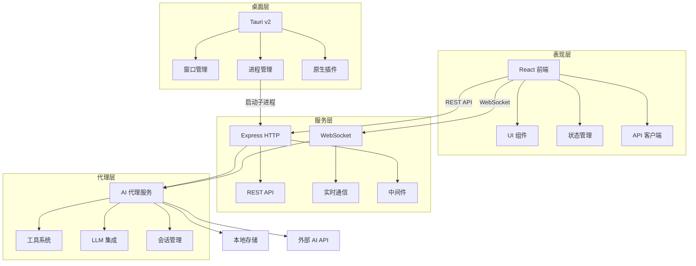

## 前端架构

### 技术栈
- **React 18**: 用户界面库
- **TypeScript**: 类型安全开发
- **Vite**: 构建工具和开发服务器
- **Tailwind CSS**: 实用优先的 CSS 框架

### 组件组织

```
desktop/src/
├── api/                    # API 客户端模块
│   ├── client.ts          # 基础 HTTP 客户端
│   ├── sessions.ts        # 会话 API
│   ├── providers.ts       # 服务商 API
│   └── usage.ts           # 用量统计 API
├── components/            # UI 组件
│   ├── chat/             # 聊天相关组件
│   ├── editor/           # 编辑器组件
│   ├── layout/           # 布局组件
│   ├── settings/         # 设置组件
│   └── shared/           # 共享组件
├── pages/                # 页面组件
│   ├── HomePage.tsx      # 首页
│   ├── ActiveSession.tsx # 活跃会话
│   ├── SettingsPage.tsx  # 设置页
│   └── UsageStatsPage.tsx # 用量统计
├── stores/               # 状态管理
│   ├── uiStore.tsx       # UI 状态
│   ├── sessionStore.tsx  # 会话状态
│   └── chatStore.tsx     # 聊天状态
└── i18n/                 # 国际化
```

### 状态管理

使用 React Context + Hooks 模式，而非 Redux 或 Zustand：

```typescript
// 示例：UI 状态管理
const UIContext = createContext<UIState | null>(null)

export function UIProvider({ children }) {
  const [state, setState] = useState(initialState)
  // ... 状态逻辑
  return (
    <UIContext.Provider value={{ state, setState }}>
      {children}
    </UIContext.Provider>
  )
}
```

### 路由系统

采用自定义标签页导航，而非 React Router：

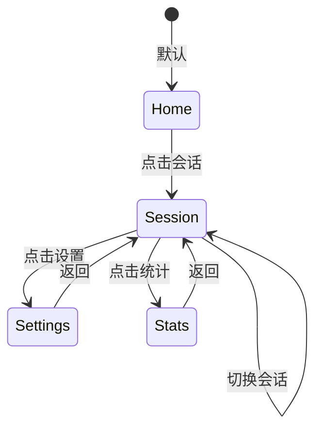

## 桌面层架构

### Tauri v2 集成

Tauri 作为桌面应用壳，提供以下功能：

1. **窗口管理**
   - 无边框窗口设计
   - 自定义窗口控件（最小化、最大化、关闭）
   - 窗口状态持久化

2. **进程管理**
   - 启动和管理 Bun 服务端子进程
   - 进程生命周期管理
   - 优雅关闭处理

3. **原生插件**
   - `@tauri-apps/plugin-dialog`: 文件对话框
   - `@tauri-apps/plugin-notification`: 系统通知
   - `@tauri-apps/plugin-shell`: 命令执行
   - `@tauri-apps/plugin-opener`: 外部链接打开

### 启动流程

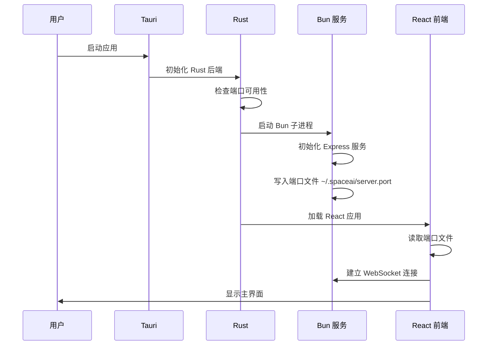

## 服务层架构

### Express HTTP 服务

服务端使用 Express 构建 REST API：

```typescript
// 服务入口
const app = express()
app.use(cors())
app.use(express.json())

// API 路由
app.use('/api/status', statusRouter)
app.use('/api/sessions', sessionRouter)
app.use('/api/providers', providerRouter)
// ... 更多路由
```

### WebSocket 服务

WebSocket 用于实时通信，支持多个通道：

```mermaid
graph LR
    A[前端] -->|连接| B[WebSocket 服务器]
    B --> C[UI 通道 /ws/{sessionId}]
    B --> D[SDK 通道 /sdk/{sessionId}]
    B --> E[语音通道 /ws/stt]
    
    C --> F[聊天消息]
    C --> G[工具执行]
    C --> H[状态更新]
    
    D --> I[外部 SDK]
    E --> J[语音输入]
```

### 中间件栈

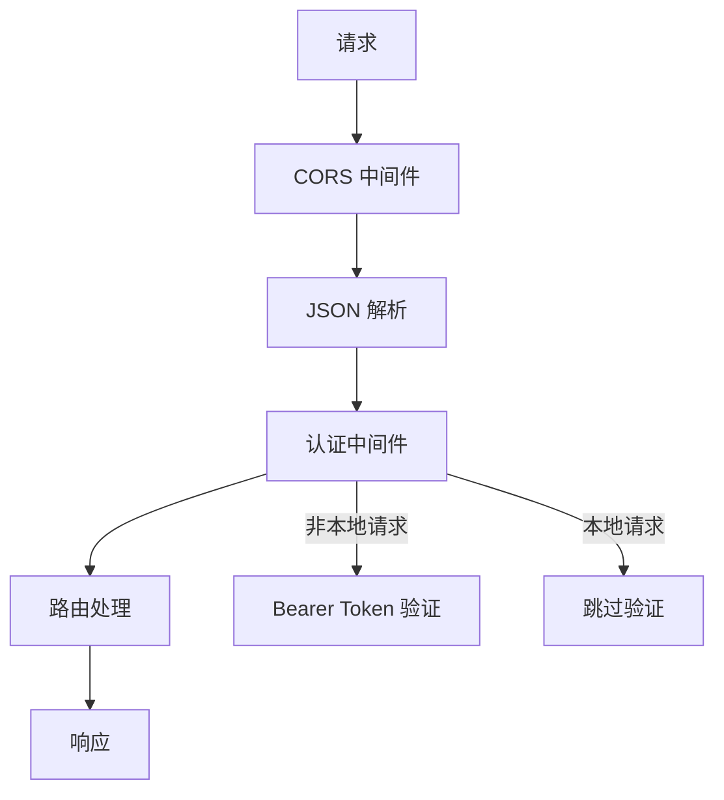

## 代理层架构

### AI 代理服务

AI 代理是系统的核心，负责：

1. **LLM 集成**: 统一接口支持多种 AI 服务商
2. **工具执行**: 调用各种工具完成任务
3. **会话管理**: 维护对话状态和历史
4. **流式处理**: 实时处理 AI 响应

### 工具系统

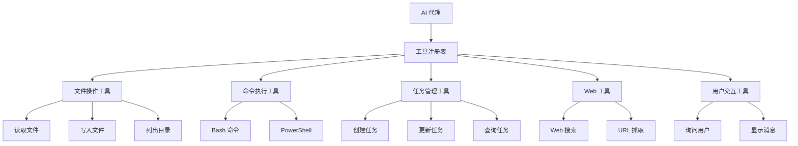

### LLM 集成

支持两种 API 格式：

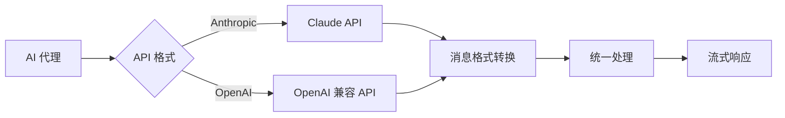

### 会话管理

会话数据以 JSONL 格式存储：

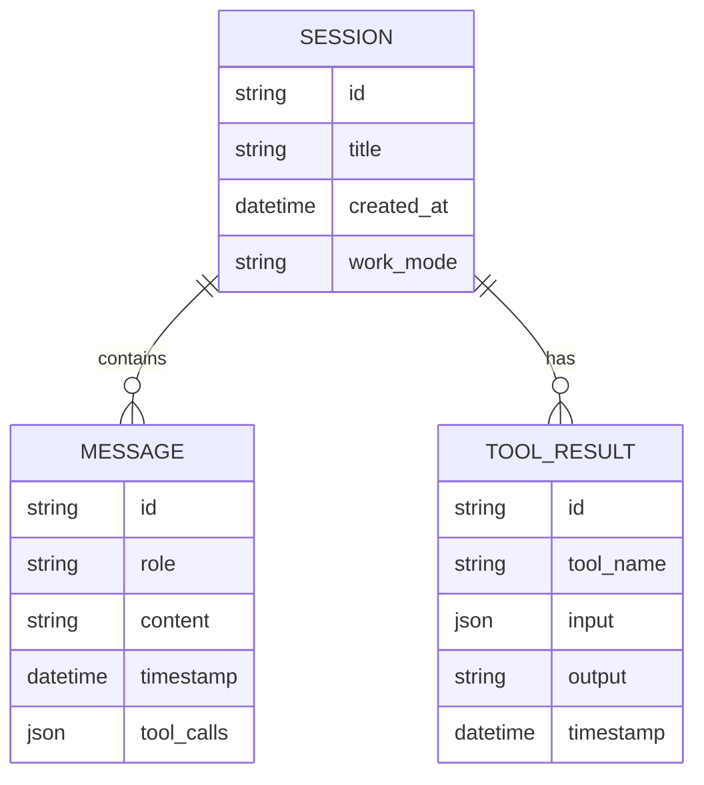

## 数据流

### 用户输入到 AI 响应

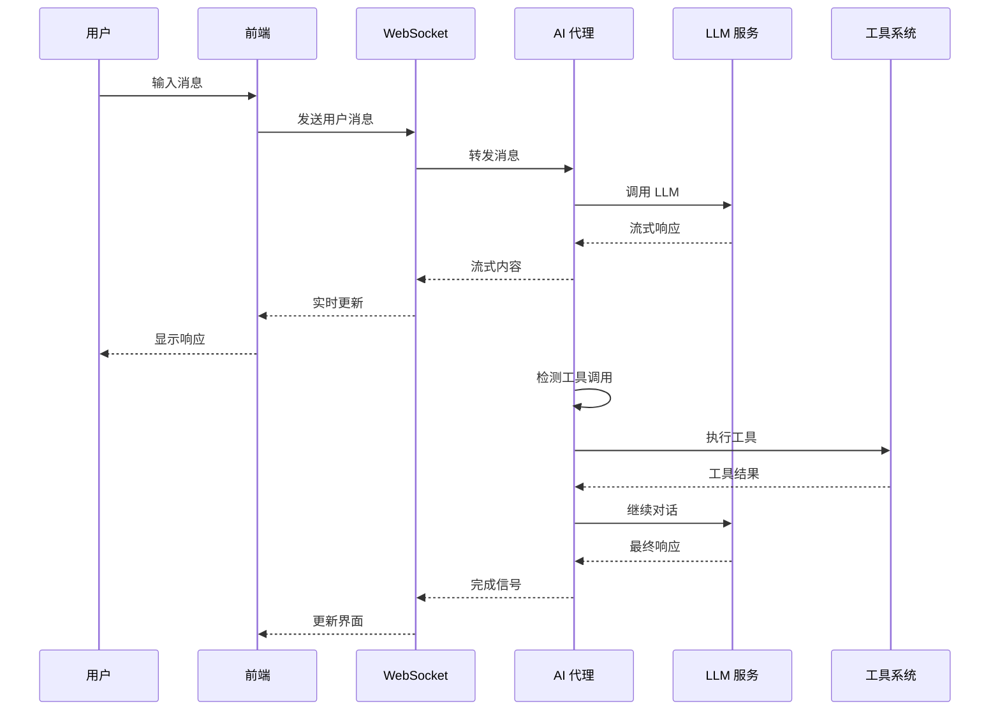

## 安全考虑

### 认证机制

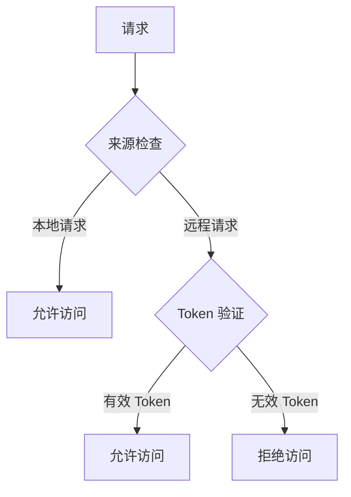

### 文件系统访问

- 限制在用户主目录和 `/tmp` 目录
- 路径遍历检查
- 敏感文件保护

### 命令执行安全

- 平台特定命令（Windows: PowerShell, Unix: bash）
- 命令白名单/黑名单
- 执行超时控制

## 性能优化

### 前端优化

1. **代码分割**: 按页面和组件分割代码
2. **懒加载**: 延迟加载非关键组件
3. **虚拟滚动**: 长列表优化
4. **缓存策略**: API 响应缓存

### 后端优化

1. **流式处理**: 减少内存占用
2. **连接池**: 数据库连接复用
3. **异步处理**: 非阻塞操作
4. **资源限制**: 防止资源耗尽

## 扩展性设计

### 插件系统

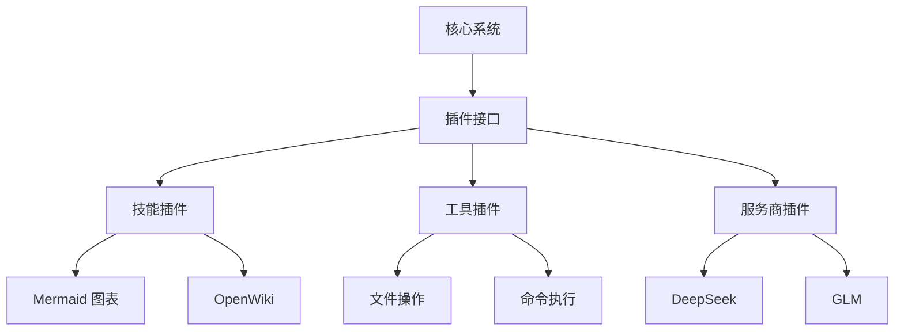

### 配置扩展

- 环境变量配置
- 配置文件热重载
- 动态配置更新

## 监控和日志

### 日志系统

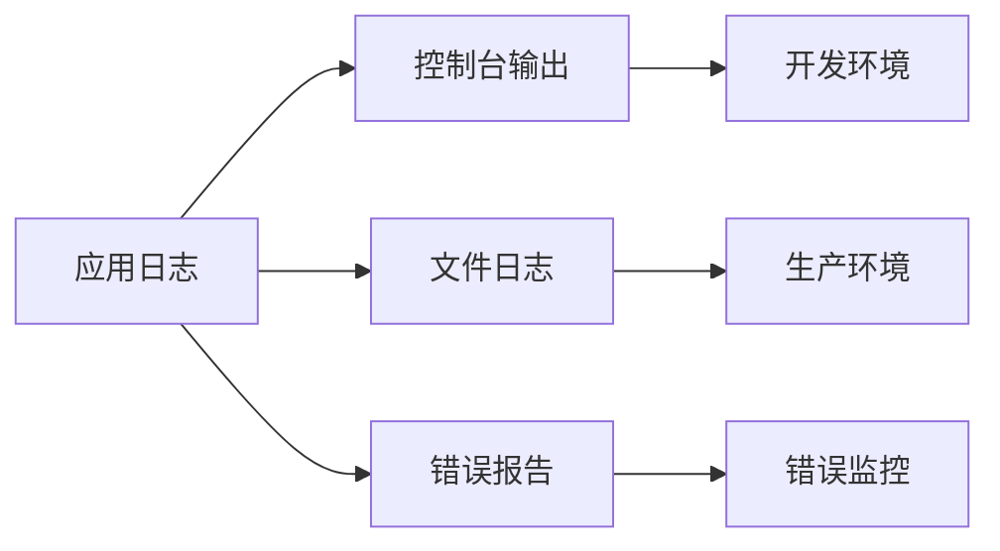

### 性能监控

- 请求响应时间
- 内存使用情况
- CPU 使用率
- 网络延迟

## 相关文档

- [前端架构](frontend.md) - 详细的前端设计
- [服务端架构](server.md) - 服务端详细设计
- [AI 代理架构](agent.md) - AI 代理系统设计
- [技术栈](../tech-stack/overview.md) - 完整技术栈列表

---

**下一步**: 了解 [前端架构](frontend.md) 的详细设计，或查看 [技术栈](../tech-stack/overview.md) 了解使用的技术。