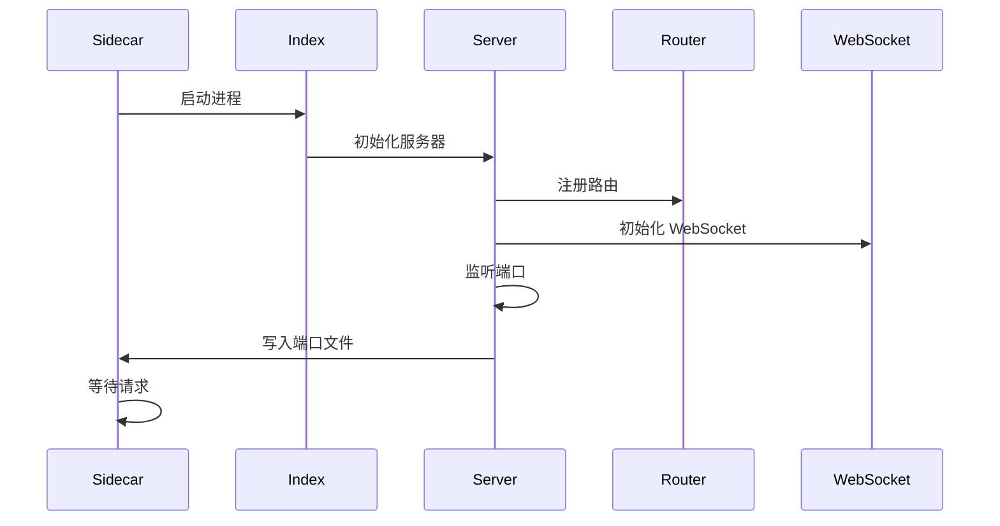
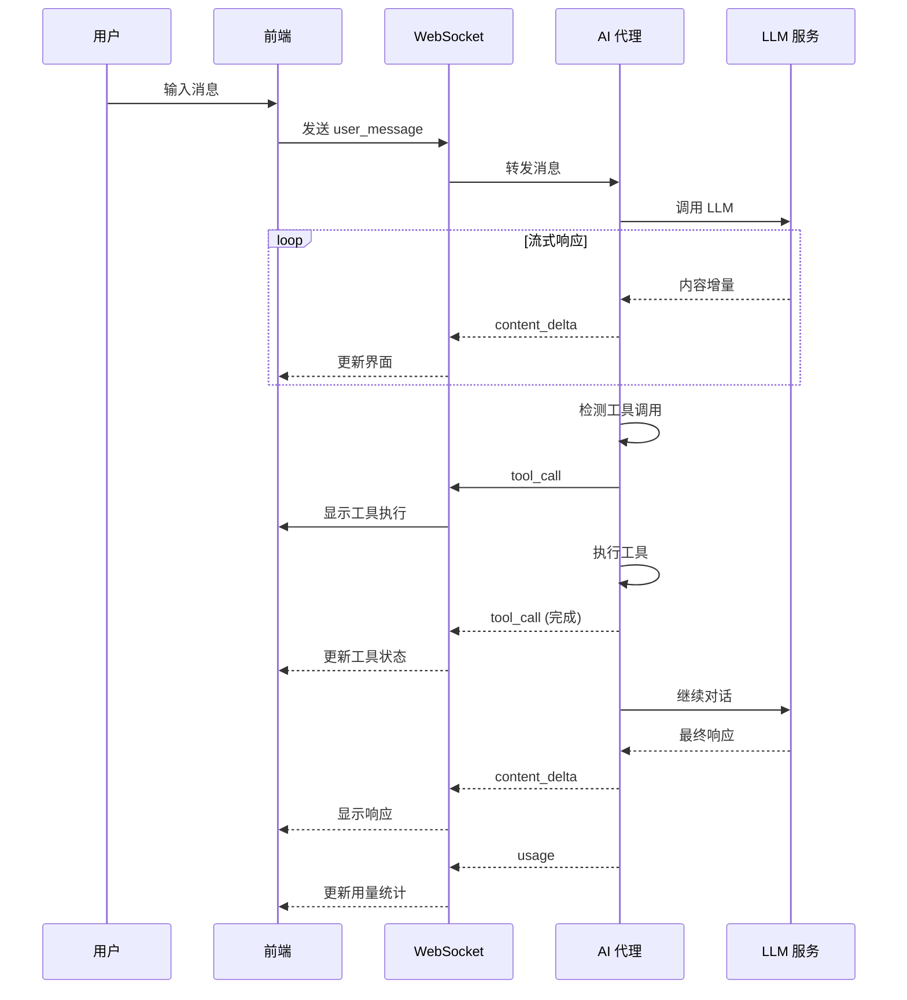
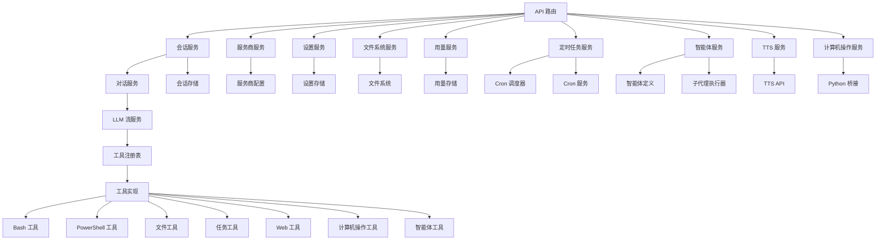
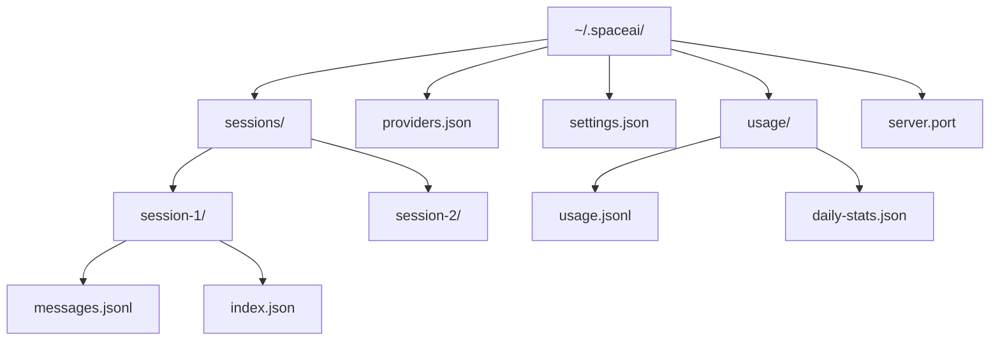

# 服务端架构

本文档详细描述 Smart Lab 服务端的架构设计，包括 Express HTTP 服务、WebSocket 通信和服务层设计。

## 技术栈

| 技术 | 版本 | 用途 |
|------|------|------|
| Bun | 1.2+ | JavaScript 运行时 |
| Express | 4.21+ | HTTP 服务框架 |
| TypeScript | 5.5+ | 类型安全开发 |
| WebSocket | - | 实时通信 |

## 目录结构

```
server/
├── src/                        # Express 服务器
│   └── index.ts               # 服务入口
├── agent/                     # AI 代理服务
│   ├── index.ts               # 代理入口
│   ├── server.ts              # 主服务器
│   ├── router.ts              # 路由定义
│   ├── sidecar.ts             # Sidecar 进程
│   ├── types.ts               # 类型定义
│   ├── api/                   # API 路由处理器
│   │   ├── status.ts
│   │   ├── sessions.ts
│   │   ├── providers.ts
│   │   ├── skills.ts
│   │   ├── computerUse.ts
│   │   ├── memory.ts
│   │   ├── settings.ts
│   │   ├── filesystem.ts
│   │   ├── git.ts
│   │   ├── tasks.ts
│   │   ├── usage.ts
│   │   ├── scheduled-tasks.ts # 定时任务 API
│   │   ├── tts.ts             # TTS 语音合成 API
│   │   └── agents.ts          # 智能体管理 API
│   ├── services/              # 业务逻辑服务
│   │   ├── conversationService.ts
│   │   ├── llmStreamService.ts
│   │   ├── sessionService.ts
│   │   ├── providerService.ts
│   │   ├── settingsService.ts
│   │   ├── skillsService.ts
│   │   ├── taskService.ts
│   │   ├── usageService.ts
│   │   ├── compactService.ts
│   │   ├── agentService.ts    # 智能体管理
│   │   ├── cronService.ts     # 定时任务 CRUD
│   │   ├── cronScheduler.ts   # 定时任务调度执行
│   │   ├── computerUseService.ts # 计算机操作服务
│   │   └── subAgentRunner.ts  # 子代理执行器
│   ├── tools/                 # AI 工具实现 (18+ 种)
│   │   ├── registry.ts
│   │   ├── BashTool.ts
│   │   ├── PowerShellTool.ts
│   │   ├── FileReadTool.ts
│   │   ├── FileWriteTool.ts
│   │   ├── FileEditTool.ts
│   │   ├── GlobTool.ts
│   │   ├── GrepTool.ts
│   │   ├── WebSearchTool.ts
│   │   ├── WebFetchTool.ts
│   │   ├── AskUserQuestionTool.ts
│   │   ├── EnterPlanModeTool.ts
│   │   ├── ExitPlanModeTool.ts
│   │   ├── SkillTool.ts
│   │   ├── TaskCreateTool.ts
│   │   ├── TaskUpdateTool.ts
│   │   ├── TaskListTool.ts
│   │   ├── NotebookEditTool.ts
│   │   ├── ComputerUseTool.ts # 计算机操作工具
│   │   └── AgentTool.ts       # 智能体调用工具
│   ├── runtime/               # 运行时脚本
│   │   └── win_helper.py      # Windows Python 桥接 (pyautogui)
│   ├── ws/                    # WebSocket 处理
│   │   ├── uiChannel.ts
│   │   ├── sdkChannel.ts
│   │   └── sttChannel.ts
│   ├── middleware/            # 中间件
│   │   ├── auth.ts
│   │   ├── cors.ts
│   │   └── error.ts
│   ├── config/                # 配置
│   │   └── index.ts
│   ├── constants/             # 常量
│   │   └── index.ts
│   └── types/                 # 类型定义
│       └── index.ts
└── dist/                      # 构建产物
    └── server.js
```

## 服务器架构

### 启动流程



### 服务器配置

```typescript
// server.ts
const app = express()
const PORT = parseInt(process.env.PORT || '3721', 10)
const HOST = process.env.HOST || '127.0.0.1'

// 中间件
app.use(cors())
app.use(express.json({ limit: '10mb' }))
app.use(authMiddleware)

// 路由
app.use('/api', router)

// WebSocket
const wss = new WebSocket.Server({ server })
setupWebSocket(wss)

// 启动服务器
const server = app.listen(PORT, HOST, () => {
  console.log(`Server running on http://${HOST}:${PORT}`)
  fs.writeFileSync('~/.spaceai/server.port', PORT.toString())
})
```

## REST API 设计

### API 路由结构

```mermaid
graph TB
    A[/api] --> B[/status]
    A --> C[/sessions]
    A --> D[/providers]
    A --> E[/skills]
    A --> F[/computer-use]
    A --> G[/memory]
    A --> H[/settings]
    A --> I[/filesystem]
    A --> J[/git]
    A --> K[/tasks]
    A --> L[/usage]
    A --> M[/scheduled-tasks]
    A --> N[/tts]
    A --> O[/agents]
    A --> P[/health]
    A --> Q[/info]
    
    C --> C1[/:id]
    C --> C1a[/:id/messages]
    C --> C1b[/:id/tools]
    
    D --> D1[/:id]
    D --> D1a[/:id/test]
    
    I --> I1[/browse]
    I --> I2[/read]
    I --> I3[/write]
    I --> I4[/delete]
    I --> I5[/mkdir]
    I --> I6[/move]
    
    M --> M1[POST /]
    M --> M2[GET /]
    M --> M3[PUT /:id]
    M --> M4[DELETE /:id]
    M --> M5[POST /:id/runs]
    
    N --> N1[POST /speak]
    
    O --> O1[GET /]
    O --> O2[POST /]
    O --> O3[PUT /:id]
    O --> O4[DELETE /:id]
```

### API 端点列表

#### 状态 API

```typescript
GET /api/status
// 响应
{
  "status": "ok",
  "version": "0.1.0",
  "uptime": 12345,
  "nodeVersion": "v18.0.0",
  "platform": "win32"
}
```

#### 会话 API

```typescript
// 获取会话列表
GET /api/sessions
// 响应
{
  "sessions": [
    {
      "id": "session-1",
      "title": "我的会话",
      "createdAt": "2024-01-01T00:00:00Z",
      "workMode": "code"
    }
  ]
}

// 创建会话
POST /api/sessions
// 请求体
{
  "title": "新会话",
  "workMode": "code"
}

// 获取会话详情
GET /api/sessions/:id

// 删除会话
DELETE /api/sessions/:id

// 获取会话消息
GET /api/sessions/:id/messages

// 发送消息
POST /api/sessions/:id/messages
// 请求体
{
  "content": "你好",
  "role": "user"
}
```

#### 服务商 API

```typescript
// 获取服务商列表
GET /api/providers

// 创建服务商
POST /api/providers
// 请求体
{
  "name": "DeepSeek",
  "apiFormat": "openai",
  "apiKey": "sk-xxx",
  "baseUrl": "https://api.deepseek.com",
  "model": "deepseek-chat"
}

// 测试服务商连接
POST /api/providers/:id/test
```

#### 文件系统 API

```typescript
// 浏览目录
GET /api/filesystem/browse?path=/home/user

// 读取文件
GET /api/filesystem/read?path=/home/user/file.txt

// 写入文件
POST /api/filesystem/write
// 请求体
{
  "path": "/home/user/file.txt",
  "content": "文件内容"
}

// 删除文件
DELETE /api/filesystem/delete?path=/home/user/file.txt

// 创建目录
POST /api/filesystem/mkdir
// 请求体
{
  "path": "/home/user/new-dir"
}

// 移动文件
POST /api/filesystem/move
// 请求体
{
  "from": "/home/user/old.txt",
  "to": "/home/user/new.txt"
}
```

#### 用量统计 API

```typescript
// 获取用量统计
GET /api/usage?days=7&provider=deepseek
// 响应
{
  "daily": [
    {
      "date": "2024-01-01",
      "inputTokens": 1000,
      "outputTokens": 500,
      "cacheRead": 100,
      "cacheCreate": 50
    }
  ],
  "models": [
    {
      "model": "deepseek-chat",
      "provider": "DeepSeek",
      "totalTokens": 1500
    }
  ]
}
```

## WebSocket 通信

### 通道设计

```mermaid
graph TB
    A[WebSocket 服务器] --> B[UI 通道 /ws/{sessionId}]
    A --> C[SDK 通道 /sdk/{sessionId}]
    A --> D[语音通道 /ws/stt]
    
    B --> E[聊天消息]
    B --> F[工具执行]
    B --> G[状态更新]
    B --> H[用量统计]
    
    C --> I[外部 SDK]
    D --> J[语音输入]
```

### 消息协议

```typescript
// 消息类型定义
interface WebSocketMessage {
  type: string
  sessionId: string
  timestamp: number
  data: any
}

// 用户输入消息
interface UserMessage extends WebSocketMessage {
  type: 'user_message'
  data: {
    content: string
    role: 'user'
  }
}

// AI 流式响应
interface ContentDelta extends WebSocketMessage {
  type: 'content_delta'
  data: {
    content: string
    thinking?: string
  }
}

// 工具调用
interface ToolCall extends WebSocketMessage {
  type: 'tool_call'
  data: {
    id: string
    name: string
    input: any
    status: 'running' | 'completed' | 'error'
    output?: string
  }
}

// 用量统计
interface UsageUpdate extends WebSocketMessage {
  type: 'usage'
  data: {
    inputTokens: number
    outputTokens: number
    cacheRead: number
    cacheCreate: number
  }
}
```

### 消息流



## 服务层设计

### 服务层架构



### 核心服务

#### 会话服务 (SessionService)

管理会话生命周期和数据持久化：

```typescript
class SessionService {
  // 创建会话
  async createSession(title: string, workMode: string): Promise<Session>
  
  // 获取会话列表
  async listSessions(): Promise<Session[]>
  
  // 获取会话详情
  async getSession(id: string): Promise<Session>
  
  // 删除会话
  async deleteSession(id: string): Promise<void>
  
  // 获取会话消息
  async getMessages(sessionId: string): Promise<Message[]>
  
  // 添加消息
  async addMessage(sessionId: string, message: Message): Promise<void>
}
```

#### 对话服务 (ConversationService)

管理 AI 对话和工具执行：

```typescript
class ConversationService {
  // 处理用户消息
  async handleMessage(sessionId: string, message: Message): Promise<void>
  
  // 执行工具调用
  async executeTool(sessionId: string, toolCall: ToolCall): Promise<ToolResult>
  
  // 管理对话历史
  async compactHistory(sessionId: string): Promise<void>
  
  // 处理中止请求
  async abortSession(sessionId: string): Promise<void>
}
```

#### LLM 流服务 (LLMStreamService)

处理 LLM API 调用和流式响应：

```typescript
class LLMStreamService {
  // 调用 LLM
  async streamCompletion(
    provider: Provider,
    messages: Message[],
    tools: Tool[]
  ): AsyncGenerator<StreamChunk>
  
  // 处理工具调用
  async handleToolCall(toolCall: ToolCall): Promise<ToolResult>
  
  // 管理上下文窗口
  async manageContext(messages: Message[]): Promise<Message[]>
}
```

#### 服务商服务 (ProviderService)

管理 LLM 服务商配置：

```typescript
class ProviderService {
  // 获取服务商列表
  async listProviders(): Promise<Provider[]>
  
  // 创建服务商
  async createProvider(provider: Provider): Promise<Provider>
  
  // 更新服务商
  async updateProvider(id: string, updates: Partial<Provider>): Promise<Provider>
  
  // 删除服务商
  async deleteProvider(id: string): Promise<void>
  
  // 测试连接
  async testConnection(id: string): Promise<TestResult>
}
```

#### 用量服务 (UsageService)

管理 Token 用量统计：

```typescript
class UsageService {
  // 记录用量
  async recordUsage(usage: UsageRecord): Promise<void>
  
  // 获取用量统计
  async getUsageStats(query: UsageQuery): Promise<UsageStats>
  
  // 获取每日统计
  async getDailyStats(days: number): Promise<DailyStats[]>
  
  // 获取模型统计
  async getModelStats(): Promise<ModelStats[]>
}
```

## 工具系统

### 工具注册表

```typescript
class ToolRegistry {
  private tools: Map<string, Tool> = new Map()
  
  // 注册工具
  register(tool: Tool): void {
    this.tools.set(tool.name, tool)
  }
  
  // 获取工具
  getTool(name: string): Tool | undefined {
    return this.tools.get(name)
  }
  
  // 获取所有工具
  getAllTools(): Tool[] {
    return Array.from(this.tools.values())
  }
}
```

### 工具接口

```typescript
interface Tool {
  name: string
  description: string
  inputSchema: JSONSchema
  
  // 执行工具
  execute(input: any, context: ToolContext): Promise<ToolResult>
  
  // 验证输入
  validateInput(input: any): boolean
}
```

### 工具实现示例

```typescript
// Bash 工具
class BashTool implements Tool {
  name = 'bash'
  description = '执行 Bash 命令'
  inputSchema = {
    type: 'object',
    properties: {
      command: { type: 'string', description: '要执行的命令' }
    },
    required: ['command']
  }
  
  async execute(input: { command: string }): Promise<ToolResult> {
    const { command } = input
    const result = await execAsync(command)
    return {
      output: result.stdout,
      error: result.stderr,
      exitCode: result.exitCode
    }
  }
}
```

## 中间件栈

### 认证中间件

```typescript
function authMiddleware(req: Request, res: Response, next: NextFunction) {
  // 本地请求跳过验证
  if (isLocalhost(req.ip)) {
    return next()
  }
  
  // 远程请求需要 Token
  const token = req.headers.authorization?.replace('Bearer ', '')
  if (!token || !isValidToken(token)) {
    return res.status(401).json({ error: 'Unauthorized' })
  }
  
  next()
}
```

### CORS 中间件

```typescript
function corsMiddleware(req: Request, res: Response, next: NextFunction) {
  const allowedOrigins = [
    'http://localhost:1420',
    'tauri://localhost',
    'https://tauri.localhost'
  ]
  
  const origin = req.headers.origin
  if (allowedOrigins.includes(origin)) {
    res.setHeader('Access-Control-Allow-Origin', origin)
  }
  
  res.setHeader('Access-Control-Allow-Methods', 'GET, POST, PUT, DELETE, OPTIONS')
  res.setHeader('Access-Control-Allow-Headers', 'Content-Type, Authorization')
  
  if (req.method === 'OPTIONS') {
    return res.sendStatus(200)
  }
  
  next()
}
```

### 错误处理中间件

```typescript
function errorMiddleware(err: Error, req: Request, res: Response, next: NextFunction) {
  console.error('Error:', err)
  
  if (err instanceof ValidationError) {
    return res.status(400).json({ error: err.message })
  }
  
  if (err instanceof NotFoundError) {
    return res.status(404).json({ error: err.message })
  }
  
  res.status(500).json({ error: 'Internal Server Error' })
}
```

## 存储设计

### 存储结构



### JSONL 格式

```typescript
// 会话消息 JSONL 格式
{"id":"msg-1","role":"user","content":"你好","timestamp":1704067200000}
{"id":"msg-2","role":"assistant","content":"你好！有什么可以帮助你的吗？","timestamp":1704067201000}
{"id":"msg-3","role":"tool","toolName":"bash","input":{"command":"ls"},"output":"file1.txt\nfile2.txt","timestamp":1704067202000}
```

### 索引文件

```typescript
// 会话索引
{
  "id": "session-1",
  "title": "我的会话",
  "createdAt": "2024-01-01T00:00:00Z",
  "updatedAt": "2024-01-01T01:00:00Z",
  "workMode": "code",
  "messageCount": 10,
  "lastMessage": "你好！"
}
```

## 安全机制

### 文件系统访问控制

```typescript
function isPathAllowed(path: string): boolean {
  const homeDir = os.homedir()
  const tmpDir = os.tmpdir()
  
  // 只允许访问主目录和临时目录
  return path.startsWith(homeDir) || path.startsWith(tmpDir)
}
```

### 命令执行安全

```typescript
function executeCommand(command: string): Promise<CommandResult> {
  // 平台特定命令
  const shell = process.platform === 'win32' ? 'powershell' : 'bash'
  
  // 命令白名单检查
  if (!isCommandAllowed(command)) {
    throw new Error('Command not allowed')
  }
  
  // 执行超时控制
  return execAsync(command, { timeout: 30000 })
}
```

## 性能优化

### 连接池

```typescript
// HTTP 连接池
const httpAgent = new http.Agent({
  keepAlive: true,
  maxSockets: 10,
  maxFreeSockets: 5,
  timeout: 60000,
  freeSocketTimeout: 30000
})
```

### 缓存策略

```typescript
// 内存缓存
const cache = new Map<string, { data: any; timestamp: number }>()

function getCached<T>(key: string, ttl: number): T | null {
  const cached = cache.get(key)
  if (cached && Date.now() - cached.timestamp < ttl) {
    return cached.data
  }
  return null
}
```

### 异步处理

```typescript
// 异步任务队列
class AsyncTaskQueue {
  private queue: Task[] = []
  private processing = false
  
  async add(task: Task): Promise<void> {
    this.queue.push(task)
    if (!this.processing) {
      await this.process()
    }
  }
  
  private async process(): Promise<void> {
    this.processing = true
    while (this.queue.length > 0) {
      const task = this.queue.shift()
      await task.execute()
    }
    this.processing = false
  }
}
```

## 监控和日志

### 日志系统

```typescript
import winston from 'winston'

const logger = winston.createLogger({
  level: 'info',
  format: winston.format.combine(
    winston.format.timestamp(),
    winston.format.json()
  ),
  transports: [
    new winston.transports.Console(),
    new winston.transports.File({ filename: 'error.log', level: 'error' }),
    new winston.transports.File({ filename: 'combined.log' })
  ]
})
```

### 性能监控

```typescript
// 请求计时
function requestTimer(req: Request, res: Response, next: NextFunction) {
  const start = Date.now()
  
  res.on('finish', () => {
    const duration = Date.now() - start
    logger.info({
      method: req.method,
      url: req.url,
      status: res.statusCode,
      duration
    })
  })
  
  next()
}
```

## 相关文档

- [架构概述](overview.md) - 整体架构设计
- [前端架构](frontend.md) - 前端详细设计
- [AI 代理架构](agent.md) - AI 代理系统设计
- [API 文档](../api/overview.md) - API 接口说明

---

**下一步**: 了解 [AI 代理架构](agent.md) 的详细设计，或查看 [API 文档](../api/overview.md) 了解具体接口。