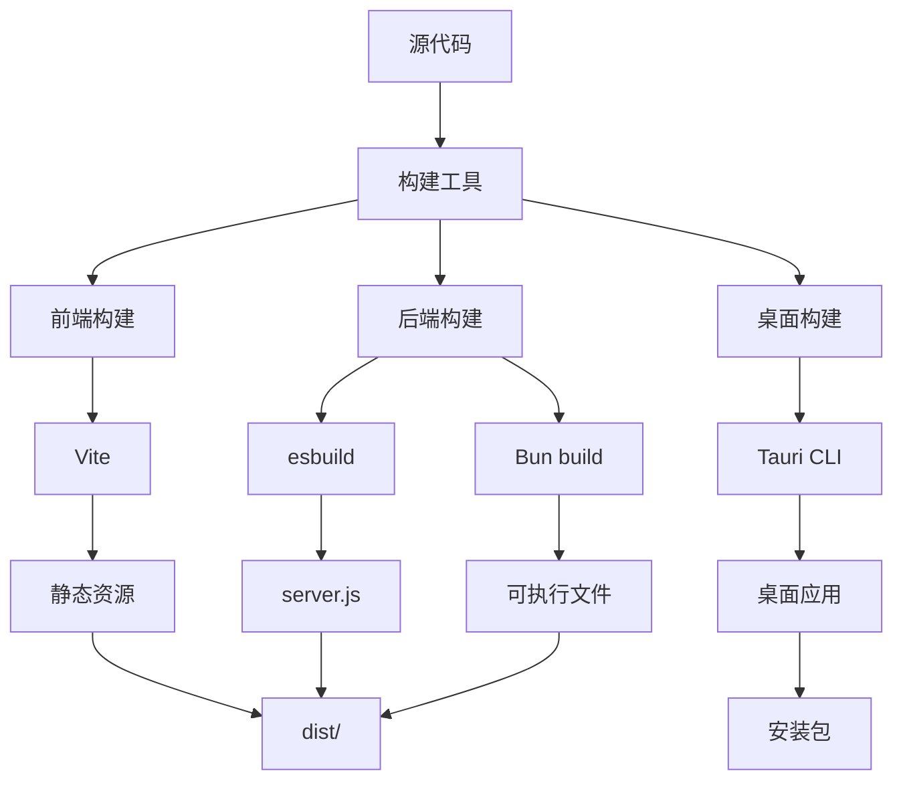
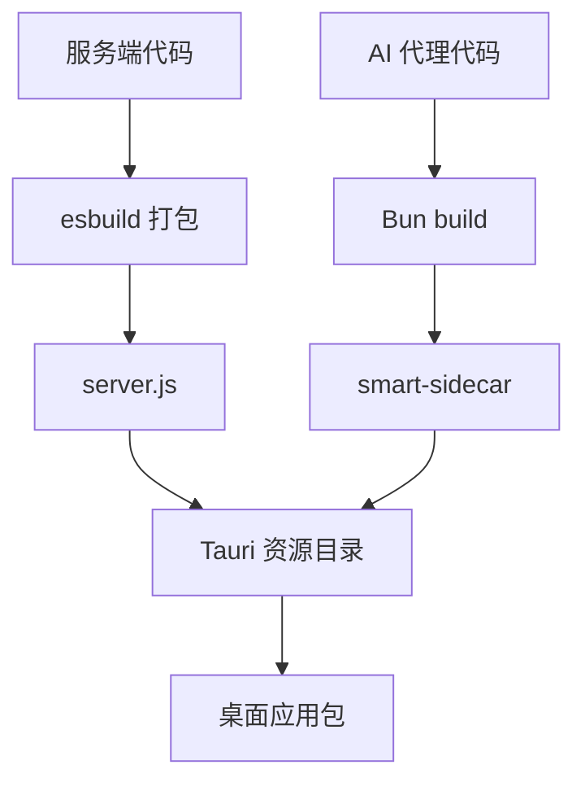
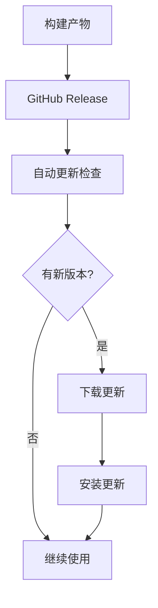

# 构建与部署

本文档描述 Smart Space 项目的构建、打包和部署流程，包括各平台的构建命令和发布策略。

## 构建架构



## 构建命令

### 根目录命令

```bash
# 构建所有组件
npm run build:all

# 构建服务端
npm run build:server

# 构建 AI 代理
npm run build:agent

# 构建桌面端
npm run build:desktop
```

### 前端构建

```bash
cd desktop

# 开发构建
npm run build

# 生产构建
npm run build:full
```

**构建输出**:
```
desktop/dist/
├── index.html              # 入口文件
├── assets/                 # 静态资源
│   ├── index-[hash].js     # 主脚本
│   ├── index-[hash].css    # 样式
│   └── vendor-[hash].js    # 第三方库
└── vite.svg                # 图标
```

### 后端构建

```bash
cd server

# 构建服务端
npm run build
```

**构建输出**:
```
server/dist/
└── server.js               # 服务端打包文件
```

### AI 代理构建

```bash
cd server/agent

# 构建通用版本
bun run build

# 构建 Windows 版本
bun run build:windows
```

**构建输出**:
```
server/dist/agent/
└── smart-sidecar           # 可执行文件
```

## 桌面应用打包

### Tauri 打包命令

```bash
cd desktop

# 打包当前平台
npx tauri build

# 打包特定平台
npx tauri build --target nsis    # Windows
npx tauri build --target dmg     # macOS
npx tauri build --target appimage # Linux
```

### 打包配置

#### tauri.conf.json

```json
{
  "build": {
    "beforeDevCommand": "npm run dev",
    "beforeBuildCommand": "npm run build:full",
    "devUrl": "http://localhost:1420",
    "frontendDist": "../dist"
  },
  "app": {
    "title": "Smart Space",
    "windows": [
      {
        "title": "Smart Space",
        "width": 1200,
        "height": 800,
        "resizable": true,
        "fullscreen": false
      }
    ],
    "security": {
      "csp": null
    }
  },
  "bundle": {
    "active": true,
    "targets": "all",
    "icon": [
      "icons/32x32.png",
      "icons/128x128.png",
      "icons/128x128@2x.png",
      "icons/icon.icns",
      "icons/icon.ico"
    ],
    "resources": [
      "../../server/dist/agent/*"
    ]
  }
}
```

### 资源嵌入



## 各平台构建

### Windows 构建

#### 前置要求

- Windows 10/11
- Visual Studio Build Tools
- Rust 工具链
- NSIS（用于安装程序）

#### 构建命令

```bash
# 构建 Windows 安装程序
cd desktop
npx tauri build --target nsis
```

#### 输出文件

```
desktop/src-tauri/target/release/bundle/
├── nsis/
│   └── Smart Space_0.1.0_x64-setup.exe
└── msi/
    └── Smart Space_0.1.0_x64_en-US.msi
```

### macOS 构建

#### 前置要求

- macOS 10.15+
- Xcode Command Line Tools
- Rust 工具链

#### 构建命令

```bash
# 构建 macOS 磁盘映像
cd desktop
npx tauri build --target dmg
```

#### 输出文件

```
desktop/src-tauri/target/release/bundle/
├── dmg/
│   └── Smart Space_0.1.0_x64.dmg
└── macos/
    └── Smart Space.app
```

### Linux 构建

#### 前置要求

- Ubuntu 20.04+ 或其他主流发行版
- 必要的系统依赖
- Rust 工具链

#### 构建命令

```bash
# 构建 AppImage
cd desktop
npx tauri build --target appimage
```

#### 输出文件

```
desktop/src-tauri/target/release/bundle/
├── appimage/
│   └── Smart Space_0.1.0_amd64.AppImage
└── deb/
    └── smart-space_0.1.0_amd64.deb
```

## 构建优化

### 前端优化

```typescript
// vite.config.ts
export default defineConfig({
  build: {
    // 代码分割
    rollupOptions: {
      output: {
        manualChunks: {
          vendor: ['react', 'react-dom'],
          editor: ['monaco-editor'],
          charts: ['echarts'],
        },
      },
    },
    // 压缩
    minify: 'terser',
    terserOptions: {
      compress: {
        drop_console: true,
        drop_debugger: true,
      },
    },
    // Source Map
    sourcemap: false,
  },
})
```

### 后端优化

```bash
# esbuild 优化
esbuild src/index.ts \
  --bundle \
  --platform=node \
  --target=node18 \
  --minify \
  --sourcemap \
  --outfile=dist/server.js
```

### AI 代理优化

```bash
# Bun build 优化
bun build sidecar.ts \
  --compile \
  --minify \
  --outfile ../dist/agent/smart-sidecar
```

## 持续集成

### GitHub Actions 配置

```yaml
# .github/workflows/build.yml
name: Build

on:
  push:
    branches: [main]
  pull_request:
    branches: [main]

jobs:
  build:
    runs-on: ${{ matrix.os }}
    strategy:
      matrix:
        os: [ubuntu-latest, windows-latest, macos-latest]
    
    steps:
      - uses: actions/checkout@v3
      
      - name: Setup Node.js
        uses: actions/setup-node@v3
        with:
          node-version: '18'
      
      - name: Setup Rust
        uses: dtolnay/rust-toolchain@stable
      
      - name: Setup Bun
        uses: oven-sh/setup-bun@v1
      
      - name: Install dependencies
        run: npm install
      
      - name: Build server
        run: npm run build:server
      
      - name: Build agent
        run: npm run build:agent
      
      - name: Build desktop
        run: npm run build:desktop
      
      - name: Build Tauri
        run: cd desktop && npx tauri build
      
      - name: Upload artifacts
        uses: actions/upload-artifact@v3
        with:
          name: release-${{ matrix.os }}
          path: desktop/src-tauri/target/release/bundle/
```

### 构建矩阵

| 平台 | 操作系统 | 构建目标 |
|------|----------|----------|
| Windows | windows-latest | NSIS, MSI |
| macOS | macos-latest | DMG |
| Linux | ubuntu-latest | AppImage, DEB |

## 发布流程

### 版本管理

```bash
# 更新版本号
npm version patch  # 0.1.0 -> 0.1.1
npm version minor  # 0.1.0 -> 0.2.0
npm version major  # 0.1.0 -> 1.0.0

# 推送标签
git push origin main --tags
```

### 发布检查清单

- [ ] 更新版本号
- [ ] 更新 CHANGELOG.md
- [ ] 运行测试
- [ ] 构建所有平台
- [ ] 测试安装程序
- [ ] 创建 GitHub Release
- [ ] 上传构建产物
- [ ] 更新文档

### GitHub Release

```bash
# 创建 Release
gh release create v0.1.0 \
  --title "Smart Space v0.1.0" \
  --notes "Initial release" \
  desktop/src-tauri/target/release/bundle/nsis/*.exe \
  desktop/src-tauri/target/release/bundle/dmg/*.dmg \
  desktop/src-tauri/target/release/bundle/appimage/*.AppImage
```

## 部署策略

### 桌面应用部署



### 自动更新配置

```json
{
  "updater": {
    "active": true,
    "endpoints": [
      "https://github.com/user/smart-space/releases/latest/download/latest.json"
    ],
    "dialog": true,
    "pubkey": "..."
  }
}
```

## 环境配置

### 生产环境变量

```bash
# .env.production
NODE_ENV=production
PORT=3721
HOST=127.0.0.1
```

### 开发环境变量

```bash
# .env.development
NODE_ENV=development
PORT=3721
HOST=127.0.0.1
DEBUG=*
```

## 故障排除

### 构建失败

#### Q: Rust 编译失败

```bash
# 更新 Rust
rustup update

# 清除缓存
cargo clean

# 重新编译
cargo build
```

#### Q: 前端构建失败

```bash
# 清除缓存
rm -rf node_modules
rm package-lock.json
npm install

# 重新构建
npm run build
```

#### Q: Tauri 打包失败

```bash
# 检查 Tauri 依赖
npm run tauri info

# 清除 Tauri 缓存
rm -rf desktop/src-tauri/target

# 重新打包
npx tauri build
```

### 运行时错误

#### Q: 应用启动失败

```bash
# 检查日志
RUST_LOG=debug npm run tauri:dev

# 检查端口占用
netstat -ano | findstr :3721
```

#### Q: 服务端连接失败

```bash
# 检查服务端状态
curl http://localhost:3721/api/status

# 重启服务端
npm run dev:server
```

## 性能优化

### 构建时间优化

```bash
# 并行构建
npm run build:all -- --parallel

# 增量构建
npm run build -- --incremental
```

### 包大小优化

```typescript
// 使用动态导入
const MonacoEditor = lazy(() => import('./components/editor/CodeEditor'))
const ECharts = lazy(() => import('echarts-for-react'))

// Tree Shaking
import { debounce } from 'lodash-es'
```

## 相关文档

- [快速入门](../quickstart.md) - 项目概述
- [开发指南](../development/setup.md) - 开发环境搭建
- [架构概述](../architecture/overview.md) - 系统架构
- [技术栈](../tech-stack/overview.md) - 技术栈列表

---

**下一步**: 了解 [开发指南](../development/setup.md) 搭建开发环境，或查看 [架构概述](../architecture/overview.md) 了解系统设计。