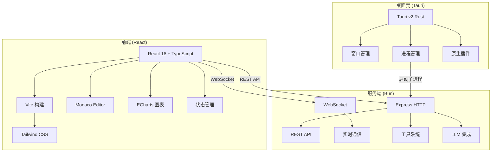
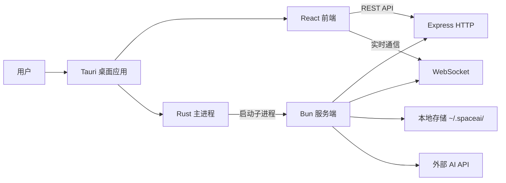

# Smart Space 快速入门

欢迎来到 Smart Space 项目！这是一个基于 Tauri + React + Bun 的桌面 AI 助手应用，支持多会话聊天、代码编辑、用量统计等功能。

## 项目概述

Smart Space 是一个功能丰富的桌面 AI 助手，具有以下核心特性：

- **多会话管理**: 支持同时运行多个独立的 AI 聊天会话
- **实时流式通信**: 通过 WebSocket 实现实时 AI 响应流
- **代码编辑集成**: 内置 Monaco 编辑器，支持代码高亮和编辑
- **工具执行系统**: AI 可以调用 16+ 种工具执行文件操作、命令执行等任务
- **用量统计**: 详细的 Token 使用量统计和图表展示
- **多服务商支持**: 支持 DeepSeek、智谱 GLM、通义千问、Moonshot 等多种 AI 服务商
- **国际化**: 支持中文和英文界面

## 技术架构



## 项目结构

```
smart-space/
├── desktop/                    # 客户端 (Vite + React + Tauri v2)
│   ├── src/                    # React 前端源码
│   │   ├── api/               # API 客户端
│   │   ├── components/        # UI 组件
│   │   ├── pages/             # 页面组件
│   │   ├── stores/            # 状态管理
│   │   ├── i18n/              # 国际化
│   │   └── theme/             # 主题配置
│   ├── src-tauri/             # Tauri Rust 后端
│   └── package.json
├── server/                     # 服务端
│   ├── src/                   # Express 服务器
│   └── agent/                 # AI 代理服务
│       ├── api/               # API 路由处理器
│       ├── services/          # 业务逻辑服务
│       ├── tools/             # AI 工具实现
│       ├── ws/                # WebSocket 处理
│       └── middleware/        # 中间件
└── package.json               # Monorepo 配置
```

## 快速开始

### 1. 环境准备

确保安装以下工具：
- **Node.js** 18+ 和 **npm**
- **Rust** 和 **Cargo** (用于 Tauri)
- **Bun** (用于服务端)

### 2. 安装依赖

```bash
# 克隆项目
git clone <repository-url>
cd smart-space

# 安装所有依赖
npm install
```

### 3. 开发模式

```bash
# 启动服务端 (热重载)
npm run dev:server

# 启动桌面端 (包含前端和服务端)
npm run dev
```

### 4. 构建部署

```bash
# 构建服务端
npm run build:server

# 构建桌面端
npm run build:desktop

# 一键构建所有
npm run build:all
```

## 核心概念

### 会话 (Session)
每个聊天会话都是独立的，包含完整的对话历史。会话数据以 JSONL 格式存储在 `~/.spaceai/sessions/` 目录下。

### 服务商 (Provider)
AI 服务商配置，包括 API 密钥、模型选择、端点 URL 等。支持预设服务商（DeepSeek、GLM 等）和自定义服务商。

### 工具 (Tool)
AI 可以调用的工具，包括文件操作、命令执行、任务管理等。工具在 `server/agent/tools/` 目录下定义。

### 技能 (Skill)
技能系统扩展 AI 能力，如 Mermaid 图表生成、OpenWiki 连接器等。技能在 `skills/` 目录下定义。

## 主要页面

| 页面 | 功能 |
|------|------|
| **首页** | 服务器状态、最近会话、快速操作 |
| **会话页** | 聊天界面、代码编辑器、文件浏览器 |
| **设置页** | 服务商配置、技能管理、通用设置 |
| **统计页** | Token 用量统计、图表展示 |

## 开发指南

### 代码风格
- 使用 TypeScript 进行类型安全开发
- 遵循 React Hooks 模式
- 中文注释和用户界面文本
- Tailwind CSS 样式

### 状态管理
使用 React Context + Hooks 模式，主要状态存储包括：
- `uiStore`: UI 状态（主题、语言、侧边栏）
- `sessionStore`: 会话列表和 CRUD 操作
- `chatStore`: 聊天消息和 WebSocket 连接

### API 通信
- **REST API**: 用于数据 CRUD 操作
- **WebSocket**: 用于实时流式通信
- 动态端口发现：从 `~/.spaceai/server.port` 读取端口

## 部署架构



## 常见问题

### Q: 如何添加新的 AI 服务商？
A: 在 `server/agent/services/providerService.ts` 中添加服务商预设，或在设置页面手动配置。

### Q: 如何添加新的工具？
A: 在 `server/agent/tools/` 目录下创建新的工具文件，并在 `registry.ts` 中注册。

### Q: 如何添加新的技能？
A: 在 `skills/` 目录下创建技能文件夹，包含 `SKILL.md` 和相关脚本。

## 相关文档

- [架构概述](architecture/overview.md) - 详细的架构设计
- [前端架构](architecture/frontend.md) - 前端详细架构
- [服务端架构](architecture/server.md) - 服务端详细架构
- [AI 代理架构](architecture/agent.md) - AI 代理系统设计
- [技术栈](tech-stack/overview.md) - 完整的技术栈列表
- [开发指南](development/setup.md) - 详细的开发环境搭建
- [API 文档](api/overview.md) - API 接口说明
- [构建与部署](deployment/build.md) - 构建和发布流程

## 获取帮助

- 查看项目 README.md 文件
- 检查 `server/agent/` 目录下的代码注释
- 查看 `desktop/src/` 目录下的组件实现
- 参考 `skills/` 目录下的技能示例

## Backlog

以下区域尚未完全文档化，将在后续更新中补充：

| 区域 | 源码锚点 | 延迟原因 |
|------|----------|----------|
| **数据模型文档** | `server/agent/types.ts`, `desktop/src/types/` | 需要详细分析所有数据结构 |
| **工具系统文档** | `server/agent/tools/` | 需要文档化 16+ 种工具的实现细节 |
| **技能系统文档** | `skills/` | 需要分析现有技能并创建扩展指南 |
| **国际化文档** | `desktop/src/i18n/` | 需要完整的翻译键值和本地化流程 |
| **测试文档** | 测试相关文件 | 需要分析测试策略和覆盖率 |
| **性能优化文档** | 构建配置和运行时 | 需要性能分析和优化建议 |
| **故障排除文档** | 常见问题和解决方案 | 需要收集和整理常见问题 |
| **安全文档** | 认证和授权机制 | 需要详细的安全策略和最佳实践 |

---

**下一步**: 阅读 [架构概述](architecture/overview.md) 了解详细的系统设计，或直接跳转到 [开发指南](development/setup.md) 开始开发。