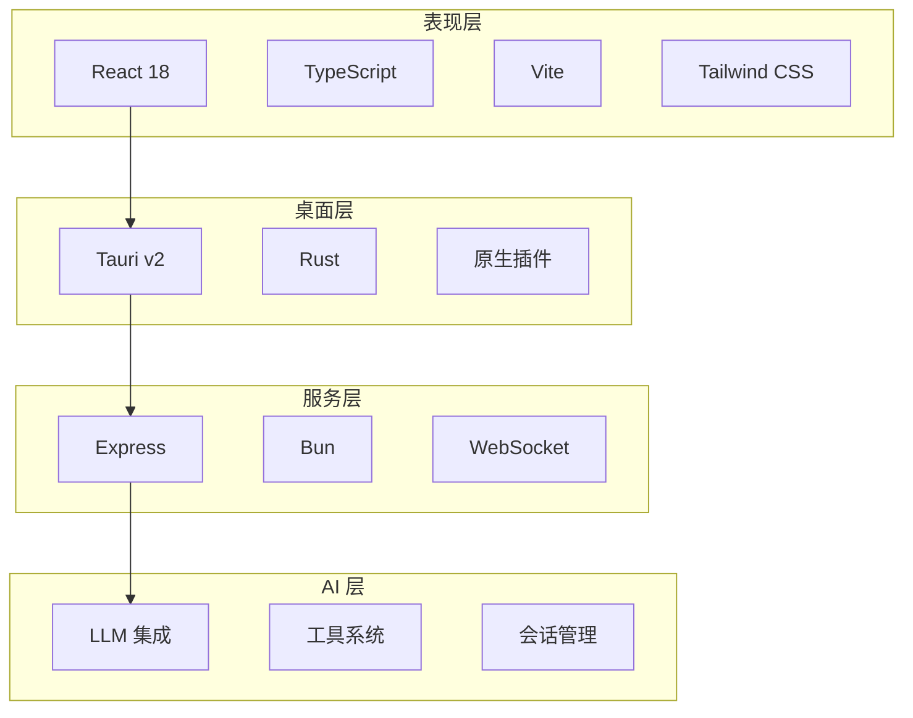
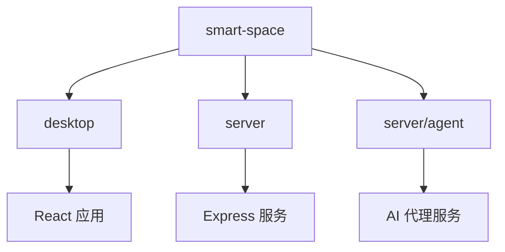
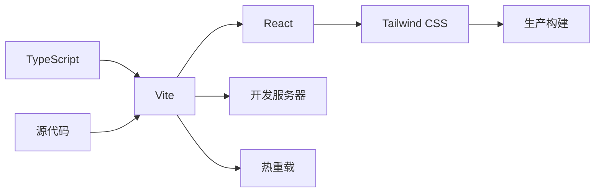
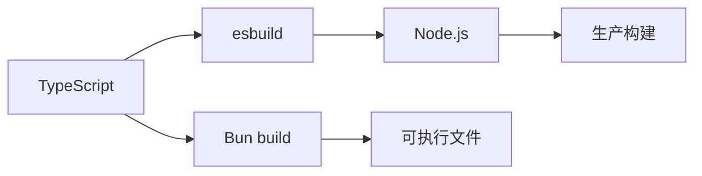
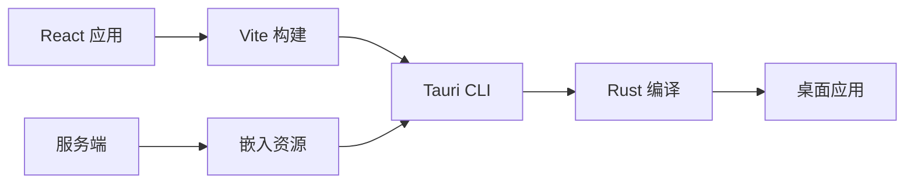
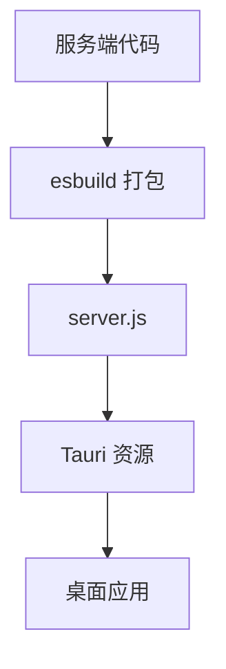

# 技术栈概览

本文档列出 Smart Lab 项目使用的完整技术栈，包括前端、后端、桌面壳和开发工具。

## 架构分层



## 前端技术栈

### 核心框架

| 技术 | 版本 | 用途 | 官网 |
|------|------|------|------|
| React | 18.3+ | 用户界面库 | https://react.dev |
| TypeScript | 5.5+ | 类型安全开发 | https://www.typescriptlang.org |
| Vite | 5.4+ | 构建工具和开发服务器 | https://vitejs.dev |
| Tailwind CSS | 4.3+ | 实用优先的 CSS 框架 | https://tailwindcss.com |

### UI 组件库

| 技术 | 版本 | 用途 | 官网 |
|------|------|------|------|
| Monaco Editor | 0.55+ | 代码编辑器 | https://microsoft.github.io/monaco-editor |
| ECharts | 6.1+ | 图表库 | https://echarts.apache.org |
| Mermaid | 10.9+ | 图表渲染 | https://mermaid.js.org |
| react-markdown | 10.1+ | Markdown 渲染 | https://github.com/remarkjs/react-markdown |
| react-diff-viewer-continued | 3.4+ | 代码差异查看器 | https://github.com/praneshr/react-diff-viewer |
| DOMPurify | 3.4+ | HTML 净化 | https://github.com/cure53/DOMPurify |

### 状态管理

| 技术 | 版本 | 用途 | 官网 |
|------|------|------|------|
| Zustand | 5.0+ | 状态管理（备用） | https://zustand-demo.pmnd.rs |
| React Context | - | 内置状态管理 | https://react.dev/reference/react/createContext |

### 开发工具

| 技术 | 版本 | 用途 | 官网 |
|------|------|------|------|
| ESLint | - | 代码检查 | https://eslint.org |
| Prettier | - | 代码格式化 | https://prettier.io |
| Jest | - | 单元测试 | https://jestjs.io |
| React Testing Library | - | React 测试工具 | https://testing-library.com/docs/react-testing-library/intro |

## 桌面壳技术栈

### Tauri 框架

| 技术 | 版本 | 用途 | 官网 |
|------|------|------|------|
| Tauri | v2 | 桌面应用框架 | https://tauri.app |
| Rust | - | 系统编程语言 | https://www.rust-lang.org |
| Webview | - | 浏览器引擎 | https://webview.dev |

### Tauri 插件

| 插件 | 版本 | 用途 |
|------|------|------|
| @tauri-apps/plugin-dialog | 2.7+ | 文件对话框 |
| @tauri-apps/plugin-notification | 2.3+ | 系统通知 |
| @tauri-apps/plugin-shell | 2.0+ | 命令执行 |
| @tauri-apps/plugin-opener | 2.5+ | 外部链接打开 |

### 构建工具

| 技术 | 版本 | 用途 |
|------|------|------|
| @tauri-apps/cli | 2.0+ | Tauri 命令行工具 |
| Cargo | - | Rust 包管理器 |
| tauri-build | - | Tauri 构建脚本 |

## 服务端技术栈

### 运行时和框架

| 技术 | 版本 | 用途 | 官网 |
|------|------|------|------|
| Bun | 1.2+ | JavaScript 运行时 | https://bun.sh |
| Express | 4.21+ | HTTP 服务框架 | https://expressjs.com |
| TypeScript | 5.5+ | 类型安全开发 | https://www.typescriptlang.org |

### WebSocket

| 技术 | 版本 | 用途 | 官网 |
|------|------|------|------|
| ws | - | WebSocket 服务器 | https://github.com/websockets/ws |
| WebSocket | - | 浏览器原生 WebSocket | https://developer.mozilla.org/en-US/docs/Web/API/WebSocket |

### 数据存储

| 技术 | 用途 | 存储位置 |
|------|------|----------|
| JSONL | 会话消息存储 | ~/.spaceai/sessions/ |
| JSON | 配置和索引 | ~/.spaceai/ |
| 文件系统 | 文件操作 | 用户主目录 |

### 开发工具

| 技术 | 版本 | 用途 |
|------|------|------|
| esbuild | 0.23+ | 快速打包工具 |
| tsx | 4.16+ | TypeScript 执行器 |
| Bun build | - | Bun 内置打包工具 |

## AI 集成技术栈

### LLM 服务商

| 服务商 | API 格式 | 模型示例 |
|--------|----------|----------|
| Anthropic | Anthropic | Claude 3.5 Sonnet |
| OpenAI | OpenAI | GPT-4, GPT-3.5-turbo |
| DeepSeek | OpenAI | deepseek-chat |
| 智谱 GLM | OpenAI | glm-4 |
| 通义千问 | OpenAI | qwen-max |
| Moonshot | OpenAI | moonshot-v1-8k |
| MiniMax | OpenAI | abab5.5-chat |

### 工具系统

| 工具 | 用途 |
|------|------|
| BashTool | 执行 Bash 命令 |
| PowerShellTool | 执行 PowerShell 命令 |
| FileReadTool | 读取文件内容 |
| FileWriteTool | 写入文件内容 |
| ListDirTool | 列出目录内容 |
| TaskTool | 任务管理 |
| WebSearchTool | Web 搜索 |
| WebFetchTool | 抓取网页内容 |
| AskUserTool | 询问用户 |

## 包管理

### Monorepo 结构



### 依赖管理

```json
{
  "workspaces": [
    "desktop",
    "server",
    "server/agent"
  ]
}
```

## 构建工具链

### 前端构建



### 后端构建



### 桌面构建



## 开发工具链

### 代码质量

| 工具 | 用途 |
|------|------|
| ESLint | JavaScript/TypeScript 代码检查 |
| Prettier | 代码格式化 |
| TypeScript | 类型检查 |

### 测试工具

| 工具 | 用途 |
|------|------|
| Jest | 单元测试框架 |
| React Testing Library | React 组件测试 |
| Vitest | Vite 原生测试框架 |

### 开发服务器

| 工具 | 用途 | 端口 |
|------|------|------|
| Vite | 前端开发服务器 | 1420 |
| tsx | 后端热重载 | 3721 |
| Tauri | 桌面应用开发 | - |

## 部署技术栈

### 生产部署

| 技术 | 用途 |
|------|------|
| Tauri CLI | 桌面应用打包 |
| NSIS | Windows 安装程序 |
| DMG | macOS 磁盘映像 |
| AppImage | Linux 应用包 |

### 资源嵌入



## 运行时依赖

### 系统要求

| 平台 | 最低版本 |
|------|----------|
| Windows | Windows 10+ |
| macOS | macOS 10.15+ |
| Linux | Ubuntu 20.04+ |

### 运行时环境

| 运行时 | 版本 | 用途 |
|--------|------|------|
| Node.js | 18+ | 服务端运行时 |
| Bun | 1.2+ | AI 代理运行时 |
| Rust | 1.70+ | Tauri 编译 |

## 国际化支持

### 语言支持

| 语言 | 代码 | 状态 |
|------|------|------|
| 中文（简体） | zh-CN | 完全支持 |
| 英文 | en-US | 完全支持 |

### 翻译文件

```
desktop/src/i18n/
├── index.ts          # i18n 配置
├── zh-CN.ts          # 中文翻译（400+ 键）
└── en-US.ts          # 英文翻译
```

## 主题支持

### 主题模式

| 模式 | 说明 |
|------|------|
| Light | 浅色主题 |
| Dark | 深色主题 |
| System | 跟随系统设置 |

### 主题配置

```css
:root {
  --color-primary: #3b82f6;
  --color-background: #ffffff;
  --color-text: #1f2937;
}

[data-theme='dark'] {
  --color-background: #1f2937;
  --color-text: #f9fafb;
}
```

## 性能优化技术

### 前端优化

| 技术 | 用途 |
|------|------|
| 代码分割 | 按路由和组件分割代码 |
| 懒加载 | 延迟加载非关键组件 |
| 虚拟滚动 | 长列表优化 |
| 缓存策略 | API 响应缓存 |

### 后端优化

| 技术 | 用途 |
|------|------|
| 流式处理 | 减少内存占用 |
| 连接池 | HTTP 连接复用 |
| 异步处理 | 非阻塞操作 |
| 资源限制 | 防止资源耗尽 |

## 安全技术

### 认证和授权

| 技术 | 用途 |
|------|------|
| Bearer Token | API 认证 |
| CORS | 跨域资源共享控制 |
| 路径检查 | 文件系统访问控制 |

### 数据安全

| 技术 | 用途 |
|------|------|
| DOMPurify | HTML 净化 |
| 路径验证 | 防止路径遍历 |
| 命令过滤 | 防止危险命令执行 |

## 相关文档

- [架构概述](../architecture/overview.md) - 整体架构设计
- [前端架构](../architecture/frontend.md) - 前端详细设计
- [服务端架构](../architecture/server.md) - 服务端详细设计
- [开发指南](../development/setup.md) - 开发环境搭建

---

**下一步**: 了解 [开发指南](../development/setup.md) 搭建开发环境，或查看 [架构概述](../architecture/overview.md) 了解系统设计。